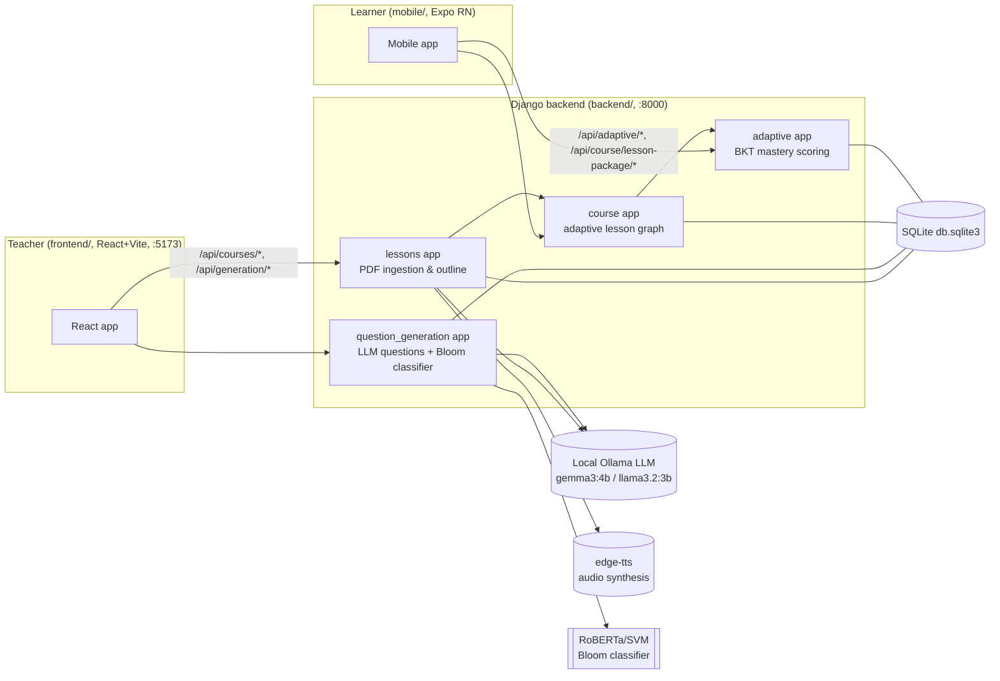
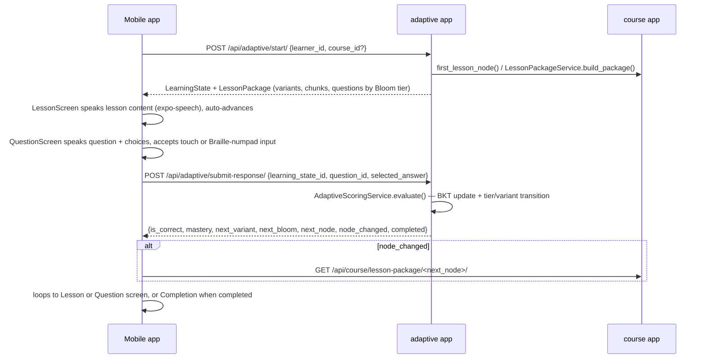
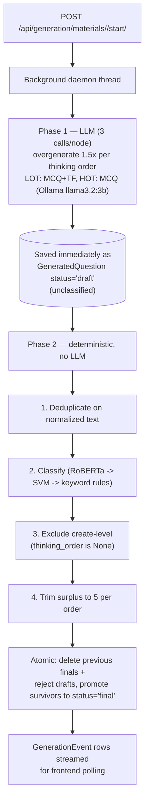

# CLAUDE.md

This file provides guidance to Claude Code (claude.ai/code) when working with code in this repository.

## Project Overview

**MAVIA** — "Audio-Tactile Braille Learning Assistant Using Adaptive Mastery Paths" (from [README.md](README.md)).

MAVIA is a thesis/capstone system with three parts working together:

1. A **Django backend** that ingests teacher-uploaded PDF course materials, uses a local LLM (Ollama) to extract structured lesson content, generates practice questions at three difficulty tiers, classifies each question's cognitive level with a fine-tuned Bloom's-taxonomy transformer, synthesizes audio narration (TTS), and serves an adaptive (Bayesian Knowledge Tracing) mastery-path API.
2. A **React web frontend** — the **teacher-facing** authoring tool: upload course outlines and lesson PDFs, review/edit the extracted hierarchy and content, trigger question generation, and generate audio playlists.
3. A **React Native (Expo) mobile app** — the **learner-facing** app, purpose-built for **low-vision and blind students using a physical Braille notetaker device** (a "BOW HW157" numpad) as input, with full TTS narration and screen-reader support, driving through the adaptive mastery path one lesson/question at a time.

Everything runs **locally** for this milestone: SQLite database, local Ollama LLM server, no cloud services. Token/session auth exists (`user` app) but is applied unevenly — see Authentication below. This is explicitly a dev/thesis-defense build, not a production multi-tenant system.

### Team ownership (relevant to how you should scope work)
- This user (Jure) owns **question/answer generation** and the **Bloom's classifier** (`backend/question_generation/`).
- A groupmate owns **PDF/content extraction** (`backend/lessons/`).
- **Answering** (student-facing quiz flow) is not this user's part.
Keep changes scoped accordingly unless explicitly asked to touch another area.

### High-Level Architecture



**Key naming gotcha:** despite the names, the **`course`** Django app models the *adaptive lesson graph* (CourseModule/LessonNode/LessonVariant/ModuleQuestion), while the **`lessons`** app models *content ingestion* (CourseGroup/OutlineNode/LearningMaterial/LearningObject). Don't confuse them.

---

## Technology Stack

**Backend** (`backend/`, [requirements.txt](backend/requirements.txt)):
- Python, Django ≥5.0,<6.0, Django REST Framework ≥3.15, django-cors-headers
- SQLite (`db.sqlite3`) — no Postgres
- PyMuPDF (`fitz`) for PDF text/block extraction
- Local **Ollama** for all LLM calls (raw HTTP via `requests`, no ollama python client)
- `edge-tts` for narration audio synthesis (async, MP3, default voice `en-US-AriaNeural`)
- `sentence-transformers` (pulls in `torch`+`transformers` transitively) for the RoBERTa Bloom's classifier
- `scikit-learn` + `joblib` for the SVM fallback classifier, `nltk` for its text preprocessing

**Frontend** (`frontend/`, [package.json](frontend/package.json)):
- React 18.3.1 (plain JS/JSX, no TypeScript), Vite 5.4.21, react-router-dom 6.26.2
- No state library, no CSS framework — single hand-written global stylesheet (`src/index.css`), CSS custom properties
- No test framework, no ESLint config configured

**Mobile** (`mobile/`, [package.json](mobile/package.json)):
- Expo SDK ~57.0.7, React 19.2.3, React Native 0.86.0, TypeScript ~6.0.3
- `@react-navigation/native` + `native-stack` (flat stack navigator, no tabs/drawer)
- `axios` for HTTP, `expo-speech` for TTS (the only audio dependency — no `expo-av`, no `expo-haptics`)
- **Important:** `mobile/AGENTS.md` (pulled in via `mobile/CLAUDE.md`'s `@AGENTS.md`) warns that Expo has changed significantly — verify against https://docs.expo.dev/versions/v57.0.0/ before writing Expo code in `mobile/`.

---

## Directory Structure

```
MAVIA/
  backend/                  Django project
    config/                 settings.py, urls.py (root routing), asgi.py, wsgi.py
    lessons/                Content ingestion: CourseGroup, OutlineNode, LearningMaterial, LearningObject
      services/              outline_parser.py, instructional_content_classifier.py, content_generator.py,
                              audio_generator.py, llm_client.py, llm_helper.py
    question_generation/    LLM question generation + Bloom's classifier
      services/              question_generator.py (LLM prompts), pipeline.py (orchestration), bloom_classifier.py
      classifier/            training notebook, dataset, trained_model/ (gitignored, ~500MB, shared out-of-band)
    course/                  Adaptive lesson graph: CourseModule, LessonNode, LessonVariant, ModuleQuestion
      services.py             sync_course_outline(), sync_module_questions(), LessonPackageService
    adaptive/                BKT mastery scoring: LearningState, StudentResponse, AdaptiveScoringService
    learning_path/           Generic (pre-adaptive) ordering: PrerequisiteEdge + Kahn's topological sort
      services/               text_signals.py, edge_derivation.py, topological_sort.py, path_builder.py
      management/commands/    show_learning_path.py — inspect a material's derived path
      (teacher UI: frontend/src/components/LearningPathPanel.jsx — topic review step 3 of 4)
    media/                   Uploaded PDFs, generated audio (gitignored)
    db.sqlite3               Local database (gitignored)
    .env.example              Template for local .env (Ollama config, CORS, Django secret)
  frontend/                 Teacher-facing React web app
    src/
      api.js                  Entire API client layer (all backend calls, fetch-based)
      App.jsx, main.jsx        Routing shell
      pages/                   HomePage, CourseDetailPage, TopicDetailPage
      components/              CourseList, CreateCourseForm, CourseHierarchy
    vite.config.js             Dev server :5173, proxies /api and /media to :8000
  mobile/                    Learner-facing Expo app
    src/
      navigation/AppNavigator.tsx   Home → Lesson → Question → Completion stack
      screens/                      HomeScreen, LessonScreen, QuestionScreen, CompletionScreen
      context/LessonContext.tsx     Global lesson/adaptive-state React Context
      models/LessonPackage.ts       Shared TS types matching backend LessonPackageService output
      services/                     api.ts (axios client), lessonService.ts
      components/                   HiddenHardwareInput.tsx (Braille numpad capture), BloomProgress, PrimaryButton
      theme/                        colors.ts, theme.ts — WCAG AA/AAA contrast, 18px body text, 48px min touch target
    AGENTS.md                  Expo version warning (included by mobile/CLAUDE.md)
  CLASSIFIER_STUDY_GUIDE.md   Deep-dive defense prep on the Bloom's classifier training (see below)
```

---

## Application Flow

### Teacher authoring workflow (frontend → lessons/question_generation apps)
1. Teacher creates a course (`POST /api/courses/`) and uploads an outline PDF (`POST /api/courses/<id>/upload-outline/`).
2. `backend/lessons/services/outline_parser.py` extracts a hierarchical outline (Module → Lesson → bullets) via PyMuPDF + regex/LLM heuristics, persisted as a self-referential `OutlineNode` tree.
3. Teacher reviews/edits nodes in the frontend's `CourseHierarchy.jsx`, then confirms (`POST /api/courses/<id>/confirm-outline/`) — locks editing.
4. Per top-level outline node, teacher uploads lesson-content PDFs (`POST /api/courses/<id>/upload-material/`). `content_generator.py` + `instructional_content_classifier.py` extract PDF text blocks, classify each via LLM into 9 categories, keep only `lesson_content` as narration → persisted as `LearningObject` rows.
5. Teacher triggers question generation (`POST /api/generation/materials/<id>/start/`), which runs in a background daemon thread (see Question Generation below) and streams progress via `GenerationEvent` polling.
6. Teacher can generate audio narration playlists (`edge-tts`, `audio_generator.py`).
7. `course/services.py::sync_course_outline()` materializes the adaptive-side graph (`CourseModule`/`LessonNode`) once content is ready.

### Learner workflow (mobile → course/adaptive apps)


### Question generation pipeline (this user's core area)

**Two phases: every LLM call happens first, then one deterministic pass.** There is no
regeneration loop — this is the defining property of the current design.



- Distribution per `LearningObject`: **3 LOT + 3 HOT** (`QUESTION_DISTRIBUTION` in `question_generation/services/pipeline.py`). Three per band is what the checkpoint rule needs — one of each to advance, plus alternates to draw from on a retry. The quota is flat; there is no word-count scaling.
- **Prompts are per Bloom level, not per band.** `question_generator.py` holds one prompt per level in `GENERATION_LEVELS` (remember, understand, apply, analyze, evaluate). A band-level prompt has no reason to ever produce an *apply* question, so that level would never fill. Acceptance is still per band: `finalize_node_questions()` takes one question per distinct level first, then doubles up to fill the band.
- **A short band is not accepted.** The node's questions are still saved so a teacher can see them, but the node is **withheld from learners** until both pools are full — see `is_node_complete()` / `complete_node_ids()`. A teacher repairs a short pool via `POST /api/generation/nodes/<node_id>/questions/`; the pipeline never regenerates to fill a gap.
- **LOT/HOT is not a difficulty scale.** Bloom's describes the *kind of thinking* a question demands, not how hard it is. `remember/understand/apply → LOT`, `analyze/evaluate → HOT`, `create → excluded`. Never reintroduce an easy/medium/hard mapping — it was removed deliberately because it conflated two different concepts.
- The Bloom's classifier's label is **authoritative**. Prompts only steer the LLM toward a region; they never decide the stored label.
- **Draft rows are invisible by contract.** Every read path filters `status="final"` — if you add a new consumer of `GeneratedQuestion`, it must too, or mid-generation output leaks to learners.
- Ordering inside Phase 2 matters: dedup runs *before* classification so identical text isn't classified twice.
- See [CLASSIFIER_STUDY_GUIDE.md](CLASSIFIER_STUDY_GUIDE.md) for training methodology and results (RoBERTa 81.3% on 6-class Bloom's). Note its "3-tier difficulty ~90%" section describes the **superseded** easy/medium/hard mapping and is now historical — the code no longer does that.

### Authentication flow
**Partial, and inconsistent.** The `user` app defines a custom `User` with ADMIN/TEACHER/STUDENT roles and permission classes (`IsTeacherOrAdmin`, `IsStudent`, ...). `REST_FRAMEWORK` sets Token + Session authentication but **no** `DEFAULT_PERMISSION_CLASSES`, so gating is per-view:
- **Gated:** `course/`, `adaptive/`, `learning_path/`
- **Open:** `lessons/`, `question_generation/`

The frontend sends `Authorization: Token <token>` from `localStorage`; the mobile axios client still has no interceptor.

---

## Database

SQLite (`backend/db.sqlite3`, gitignored). `OPTIONS: {"timeout": 20}` in `settings.py` — needed because question generation writes `GenerationEvent` rows from a background thread while the frontend polls, so writes wait out transient SQLite locks.

### Models by app

**`lessons`** (content ingestion):
- `CourseGroup` — title, description, timestamps
- `CourseOutline` — OneToOne→CourseGroup, `outline_file`, `is_approved`
- `OutlineNode` — self-referential tree (FK `parent`), FK→CourseGroup, `title`, `related_info` (JSON), `order`, `depth`; `unique_together=(course, parent, order)`
- `LearningMaterial` — FK→CourseGroup, FK→OutlineNode (`outline_node`, `module_node` — module_node must be top-level), `pdf_file`, `extracted_text`, `generated_json` (JSON), `status` (processing/completed/failed)
- `LearningObject` — FK→LearningMaterial, `kind` (text/image), `content`, `order`
- `Question` — questions **detected in the source PDF** (not generated). Actively used by `learning_resource_linker.py`, which pairs them to `LearningObject`s via `QuestionLearningObjectLink`. Distinct from `question_generation.GeneratedQuestion`, which is the LLM-generated bank; both are live.

**`question_generation`** (this user's area):
- `GeneratedQuestion` — FK→`lessons.LearningObject` (`node`), `question_text`, `question_format` (MCQ/TF), `choices` (JSON), `correct_answer`, `bloom_level` (6-way, classifier-authoritative, indexed), `thinking_order` (**LOT/HOT**, indexed), `category`, `status` (**draft/final**, indexed). Indexes on `(node, thinking_order)` and `(node, status)`. Classification fields are blank on a draft row and filled by the finalize pass.
- `LearnerResponse` — FK→GeneratedQuestion, `learner_id`, `selected_answer`, `is_correct`. Index on `(learner_id, question)`.
- `GenerationRun` — FK→LearningMaterial, FK→LearningObject (nullable = whole-material run), `status` (running/finished/failed)
- `GenerationEvent` — FK→GenerationRun (`run`), `seq`, `event_type`, `message`, `data` (JSON); ordered/indexed on `(run, seq)` — backs the frontend's progress polling

**`course`** (adaptive lesson graph):
- `CourseModule` — OneToOne→`lessons.OutlineNode` (`source`, must be top-level)
- `LessonNode` — FK→CourseModule, OneToOne→`lessons.LearningMaterial` (`source`)
- `LessonVariant` — FK→LessonNode, `variant` (NORMAL/ELABORATED/SIMPLIFIED), `narration`, `audio_url`; `unique_together=(lesson_node, variant)`
- `ModuleQuestion` — FK→LessonNode, FK→`question_generation.GeneratedQuestion`, `bloom_level` (**3-way**: REMEMBER/UNDERSTAND/ANALYZE — see Bloom bucketing below); `unique_together=(lesson_node, question)`; `save()` enforces the question's node belongs to the lesson_node's material

**`adaptive`** (mastery scoring):
- `LearningState` — `learner_id`, FK→CourseModule, FK→LessonNode, `mastery` (float, default 0.30), `attempts`, `tier_attempts`, `current_variant`, `current_bloom` (3-way), `reward`, `completed`
- `StudentResponse` — FK→LearningState (`responses`), FK→GeneratedQuestion, `selected_answer`, `is_correct`, `response_time`, `reward`

**Two independent derivations from `bloom_level` — don't confuse them:**
1. `question_generation` derives **`thinking_order`** (LOT/HOT) via `BLOOM_TO_THINKING_ORDER` in `bloom_classifier.py`. This is the question bank's own label.
2. `course/services.py::_bloom_bucket()` separately collapses the 6 levels into the adaptive engine's **3 UI tiers**: remember→remember, understand→understand, everything else→analyze. This feeds `ModuleQuestion.bloom_level` and `LearningState.current_bloom`, and is a deliberate many-to-one simplification, not a bug.

Both read `bloom_level` directly; neither depends on the other. The adaptive engine has never used the question bank's difficulty/thinking-order label.

Migrations exist per-app under `<app>/migrations/`; no custom migration operations of note beyond standard schema evolution.

---

## APIs

All endpoints are mounted under `/api/` (see `backend/config/urls.py`):

| Prefix | App | Router |
|---|---|---|
| `api/` | `lessons.urls` | DRF `DefaultRouter` → `/api/courses/...` |
| `api/` | `question_generation.urls` | `/api/questions/...`, `/api/generation/...` |
| `api/course/` | `course.urls` | `/api/course/sync/`, `/api/course/first-lesson/`, `/api/course/lesson-package/...` |
| `api/adaptive/` | `adaptive.urls` | `/api/adaptive/start/`, `/api/adaptive/learning-states/`, `/api/adaptive/submit-response/` |
| `api/learning-path/` | `learning_path.urls` | `/api/learning-path/materials/<id>/`, `/topics/<node_id>/`, `/edges/`, `/edges/<id>/` |

### `lessons` (`backend/lessons/urls.py`, `views.py`)
- `GET/POST /api/courses/`, `GET/PUT/PATCH/DELETE /api/courses/<pk>/` — standard CRUD on `CourseGroup`
- `GET /api/courses/<pk>/modules/`, module_materials action
- `POST /api/courses/<pk>/outline-nodes/`, nested detail (PATCH/DELETE per node)
- `POST /api/courses/<pk>/upload-outline/` — multipart PDF → parsed outline
- `DELETE /api/courses/<pk>/delete-outline/`
- `POST /api/courses/<pk>/confirm-outline/` — sets `is_approved`
- `POST /api/courses/<pk>/upload-material/` — multipart PDF → triggers content generation
- material detail / `regenerate_material_outputs` / `create_learning_object` / `confirm_learning_objects` / `classified_block_detail` / `learning_object_detail`
- `generate_audio_playlist` — body `{scope: "all"|"lessons"|"questions"}`, triggers edge-tts

### `question_generation` (`backend/question_generation/urls.py`, `views.py`)
- `GET /api/questions/?node_id=&thinking_order=LOT|HOT&learner_id=` — random unanswered final question at that thinking order
- `POST /api/questions/submit/` — `{question_id, selected_answer, learner_id}` → records `LearnerResponse`
- `GET /api/questions/stats/?node_id=&learner_id=` — totals/answered/correct, keyed `by_thinking_order`
- `GET/PATCH/DELETE /api/generation/questions/<question_id>/` — teacher edits/deletes a question
- `GET /api/generation/nodes/<node_id>/questions/` — pool status for one node: per-band counts, `is_complete`, and the questions held
- `POST /api/generation/nodes/<node_id>/questions/` — teacher authors a question to repair a short pool. The Bloom level comes from the classifier, never from the request body; create-level submissions are rejected
- `POST /api/generation/materials/<material_id>/start/` — generate for all text `LearningObject`s of a material
- `POST /api/generation/materials/<material_id>/nodes/<node_id>/start/` — generate for one node
- `GET /api/generation/materials/<material_id>/questions/` — full teacher-facing question bank **including correct answers** (never expose to learners)
- `GET /api/generation/runs/?material_id=` — list generation runs
- `GET /api/generation/runs/<run_id>/events/?after=<seq>` — poll trace events

### `course` (`backend/course/urls.py`, `views.py`)
- `POST /api/course/sync/<course_id>/` — `sync_course_outline()`, returns module/node counts
- `GET /api/course/first-lesson/?course_id=` — builds package for the first lesson node
- `GET /api/course/lesson-package/<node_id>/` — `LessonPackageService.build_package(node_id)`

### `adaptive` (`backend/adaptive/urls.py`, `views.py`)
- `POST /api/adaptive/start/` — `{course_id?, learner_id}` → creates `LearningState`, returns state + lesson package
- `GET /api/adaptive/learning-states/`, `GET /api/adaptive/learning-states/<pk>/`
- `POST /api/adaptive/submit-response/` — `{learning_state_id, question_id, selected_answer, response_time?}` → `AdaptiveScoringService.evaluate()` result

**Frontend consumes** these via a single flat client, `frontend/src/api.js` (fetch-based, `API_BASE="/api"`, proxied by Vite to `http://127.0.0.1:8000` in dev). File uploads use `FormData`.

**Mobile consumes** a subset via `mobile/src/services/api.ts` (axios, `baseURL` **hardcoded** to `http://127.0.0.1:8000/api/` — no env override) and `mobile/src/services/lessonService.ts` (`fetchLesson`, `startLearning`). Note: `QuestionScreen.tsx` calls `adaptive/submit-response/` directly via the raw axios client rather than through `lessonService.ts` — no wrapper exists for it yet.

---

## Core Components

- **`backend/question_generation/services/question_generator.py`** — **COSTAR-structured** prompts: one `_COSTAR` skeleton filled per thinking order from `OBJECTIVES`, `_STYLE_EXTRA`, `FEW_SHOT_EXAMPLES`, and `settings.QUESTION_AUDIENCE`. Calls Ollama's `/api/generate` directly via `requests` (`_ollama_generate`); structural validation (`_validate_question`) and robust JSON parsing/repair for truncated LLM output (`_parse_llm_response`, `_extract_question_objects`). Returns unclassified questions — it never assigns a label. Both prompts require every fact to come from the lesson content; HOT reasons *within* the content, never beyond it.
- **`backend/question_generation/services/pipeline.py`** — two-phase orchestration: `_draft_questions_for_node()` (all LLM calls → draft rows) then `finalize_node_questions()` (dedup→classify→exclude→trim→atomic promote). Owns `QUESTION_DISTRIBUTION`, `LEVELS_BY_BAND`, `OVERGENERATION_FACTOR`, `UNASSESSABLE_BLOOM_LEVELS`, `_dedup_key()`, and the completeness helpers `node_question_status()` / `is_node_complete()` / `complete_node_ids()`; process-level classifier cache so RoBERTa loads once (~55s) per process. Phase 1 issues one prompt per Bloom level; Phase 2 fills each band, preferring level coverage before doubling up.
- **`backend/question_generation/services/bloom_classifier.py`** — `BloomClassifier(backend="auto")` tries RoBERTa (from `question_generation/classifier/trained_model/roberta_blooms_final/`) → SVM (`bloom_svm_pipeline.joblib`) → keyword rules, in that order. Returns `{bloom_level, thinking_order, category}` via fixed lookup tables (`BLOOM_TO_THINKING_ORDER`, `BLOOM_TO_CATEGORY`). Model dir overridable via `BLOOM_MODEL_DIR` env var. **`create` maps to `thinking_order=None`** — it stays a recognized level (the model really predicts it) but signals "exclude this question".
- **`backend/lessons/services/llm_client.py`** — `LocalLLMClient` wraps Ollama's `/api/chat` (note: different endpoint than `question_generator.py`'s `/api/generate`). Supports `generate_json`, `generate_text`, `describe_image` (vision). Reads config directly from `os.getenv`, not `django.conf.settings`. Enforces Ollama-only (`LocalLLMError` otherwise).
- **`backend/lessons/services/outline_parser.py`** (1465 lines) — heaviest single service; regex/heuristic + LLM-assisted outline extraction with multiple fallback strategies and noise/verb filtering.
- **`backend/lessons/services/content_generator.py`** (1606 lines, largest) — PDF→`LearningMaterial` orchestration: text extraction, cleaning/truncation (12000-char LLM cap), classification, structured JSON generation.
- **`backend/course/services.py`** — `sync_course_outline()`, `sync_module_questions()` (Bloom bucketing), `LessonPackageService.build_package()` (the single source of truth for the `LessonPackage` shape the mobile app consumes).
- **`backend/adaptive/services.py`** — `AdaptiveScoringService.evaluate()`, the BKT + tier/variant state machine (see Application Flow above).
- **`mobile/src/context/LessonContext.tsx`** — global React Context wrapping `learningState`, pagination indices, and `updateFromSubmitResponse()` — the mobile-side mirror of the backend's adaptive state transitions. Contains a code comment confirming the backend "only ever returns the single-node `LessonPackage` shape."
- **`mobile/src/components/HiddenHardwareInput.tsx`** — invisible always-focused `TextInput` capturing raw keystrokes from the physical Braille-notetaker numpad; `QuestionScreen.tsx` maps keys `7/8/9/+` → answer choices A/B/C/D (adjacent numpad keys, findable by feel — this is the app's core tactile interaction model).

---

## Configuration

**Backend** (`backend/.env`, template at [.env.example](backend/.env.example)):
```
DJANGO_SECRET_KEY, DJANGO_DEBUG, DJANGO_ALLOWED_HOSTS
CORS_ALLOWED_ORIGINS
LLM_PROVIDER=ollama
OLLAMA_BASE_URL=http://localhost:11434
OLLAMA_MODEL / OLLAMA_VISION_MODEL   (content generation + vision; default gemma3:4b for vision)
OLLAMA_TIMEOUT / OLLAMA_VISION_TIMEOUT / OLLAMA_KEEP_ALIVE
OLLAMA_VALIDATE_OUTLINE, MAX_PDF_IMAGES_FOR_VISION
```
`QUESTION_LLM_MODEL` (default `llama3.2:3b`) is a **separate** setting used only by question generation — distinct from `OLLAMA_MODEL` used for content/lesson generation. `BLOOM_MODEL_DIR` can override where the classifier loads its weights from.

`CORS_ALLOWED_ORIGIN_REGEXES` in `settings.py` permits any `http://localhost:\d+` or `http://127.0.0.1:\d+` — fine for local dev, would need tightening for any real deployment.

Media/static: `MEDIA_ROOT=backend/media/` (gitignored), served via `static()` only when `DEBUG=True`. `STATIC_ROOT=backend/staticfiles/`.

**Frontend**: `frontend/vite.config.js` — dev server on `:5173`, proxies `/api` and `/media` to `http://127.0.0.1:8000`. No `.env` file — all config is in `vite.config.js`.

**Mobile**: `mobile/app.json` (Expo config) — no `app.config.js`, no EAS build config, no permissions block. API base URL is **hardcoded** in `mobile/src/services/api.ts` to `http://127.0.0.1:8000/api/` (works for iOS simulator/web; an Android emulator would need `10.0.2.2` instead — no env-based override exists yet).

**Classifier weights**: `backend/question_generation/classifier/trained_model/` (RoBERTa checkpoint + SVM joblib, ~500MB) is **gitignored** and shared out-of-band between teammates — a fresh clone will fall back to the SVM or keyword-rule classifier until the weights are placed there.

---

## Development Notes

**Known limitations / rough edges (verified in code, not speculation):**
- No authentication anywhere in the stack — acceptable for this milestone, not for any real deployment.
- `mobile/src/screens/LessonScreen.tsx` still reads `variant.text`, but the current `LessonVariantContent` model (`mobile/src/models/LessonPackage.ts`) has no `text` field — it has `chunks: LessonChunk[]`. `LessonContext`'s `getCurrentChunks()/getCurrentChunk()` exist but aren't wired into `LessonScreen` yet. This looks like an in-progress migration to chunk-based content (see recent commits `e964ab4`, `c1a56bc`).
- `mobile/src/screens/CompletionScreen.tsx` destructures `mastery` from `LessonContext`, but `LessonContextType` has no `mastery` field (only `getCurrentMastery()`) — `mastery` will be `undefined`/`NaN` there.
- `LessonContext.isLearningComplete` is hardcoded to always return `false` (explicit TODO comment) — not wired to the `completed` flag from `SubmitResponseResult`.
- `QuestionScreen.tsx` hardcodes `response_time: 3.5` rather than measuring actual response time, and calls `adaptive/submit-response/` directly instead of through `lessonService.ts`.
- No test framework configured in frontend or mobile; backend has `lessons/tests.py` and `question_generation/tests.py` (Django `TestCase`-based) but no CI config found.

**Areas requiring caution:**
- Changing `bloom_level` choices or the 6→3 bucketing in `course/services.py::_bloom_bucket()` affects both `ModuleQuestion` and `LearningState.current_bloom` — touches adaptive scoring behavior.
- `finalize_node_questions()` **deletes the previous run's final rows** and cascades to delete `LearnerResponse` history for that node — regenerating questions resets learner progress data for that node.
- **Any new query against `GeneratedQuestion` must filter `status="final"`.** Draft rows are unclassified, un-deduplicated raw LLM output. Current filter sites: `views.py` (4 places), `lessons/services/audio_generator.py` (3), `course/services.py::sync_module_questions()`.
- The classifier's 6 Bloom labels come from the model's own `config.json` `id2label` (alphabetical: analyze, apply, create, evaluate, remember, understand). `BLOOM_TO_THINKING_ORDER` must keep a key for **all six**, or `_normalize_level()` will silently rewrite unknown levels to "understand".
- Two different Ollama endpoints are in play: `lessons/services/llm_client.py` uses `/api/chat`, `question_generation/services/question_generator.py` uses `/api/generate` directly via `requests`. Don't assume one client covers both.
- SQLite's 20s lock timeout exists specifically to tolerate the question-generation background thread + frontend polling pattern — be careful introducing additional concurrent writers.

---

## Instructions for Future Claude Sessions

- **This user's scope is `backend/question_generation/`** (LLM question generation + Bloom's classifier) — the `bloom_classifier.py`, `question_generator.py`, `pipeline.py` trio, plus the classifier training notebook (`backend/question_generation/classifier/MAVIA_blooms_classifier_training.ipynb`). PDF/content extraction (`backend/lessons/`) belongs to a groupmate; the learner-facing answering flow is not this user's part. Default to working within `question_generation/` unless told otherwise.
- **Read [CLASSIFIER_STUDY_GUIDE.md](CLASSIFIER_STUDY_GUIDE.md) first** for any Bloom's classifier question — it has the full training methodology, dataset facts (8,767→8,696 questions after dedup, 80/20 stratified split), model comparison (Naive Bayes → LogReg → SVM → DistilBERT → RoBERTa, 70.7%→81.3% test accuracy), and the 6-class vs 3-tier accuracy distinction (~81% vs ~90%) that's central to defending the system's design.
- **Files to check first when modifying question generation:** `backend/question_generation/services/pipeline.py` (orchestration/distribution), `question_generator.py` (prompts), `bloom_classifier.py` (classification), `models.py` (`GeneratedQuestion` schema).
- **Files to check first when modifying the adaptive/mastery logic:** `backend/adaptive/services.py` (BKT algorithm), `backend/course/services.py` (`_bloom_bucket`, `LessonPackageService`), `backend/adaptive/models.py` (`LearningState`).
- **Files to check first when touching the mobile learner flow:** `mobile/src/context/LessonContext.tsx` (state shape/transitions), `mobile/src/models/LessonPackage.ts` (types — keep in sync with `course/services.py::build_package` output), `mobile/src/screens/QuestionScreen.tsx` (input handling, both touch and hardware numpad).
- **Critical architecture decisions to respect:**
  - The Bloom's classifier's output is authoritative everywhere in the pipeline — don't "fix" a question's label based on what the LLM was prompted for.
  - **LOT/HOT is a cognitive-level split, not a difficulty scale.** The old Bloom→easy/medium/hard mapping was removed on purpose (it conflated "kind of thinking" with "how hard"). Don't reintroduce it.
  - **The classifier stays Bloom's-only.** LOT/HOT is derived in application code *after* classification. Do not retrain the model to predict LOT/HOT — verified unnecessary against the notebook and the deployed `config.json`.
  - **All LLM calls happen before any post-processing.** If you need a new processing step, add it to `finalize_node_questions()` (deterministic, over DB rows) rather than back into the generation loop.
- **Common pattern:** background work (question generation, and only that, currently) runs as a daemon `threading.Thread` from the view, streaming progress via a DB-backed event log (`GenerationEvent`) that the frontend polls — not WebSockets/SSE. Follow this pattern if adding other long-running backend operations.
- **Change history:** if a `CHANGELOG_AI.md` exists (or is created) at the repo root, log AI-assisted changes there in addition to normal commits.
- **Everything assumes a local Ollama server is running** (`ollama serve`, with `gemma3:4b` and `llama3.2:3b` pulled) — if generation/content endpoints fail, check Ollama first before assuming a code bug.
