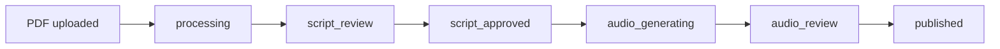

# Mavia — Science Lesson Audiobooks

Mavia turns science lesson PDFs into story-like audiobook modules inside **course groups**. Professors upload a course outline first to build a lesson hierarchy (DAG), attach PDFs to each node, review narration scripts, then publish approved audio lessons for students.

## Stack

- **Backend:** Django 5 + Django REST Framework
- **Frontend:** React 18 + Vite
- **PDF parsing:** PyMuPDF
- **Image interpretation:** OpenAI Vision (optional) with local fallback
- **Story generation:** OpenAI (optional) with template-based fallback
- **Text-to-speech:** Microsoft Edge TTS (`edge-tts`)

## Professor workflow

1. **Create a course group**
2. **Upload a course outline** (`.txt`, `.md`, or `.pdf`) — Mavia builds a **DAG of empty lesson nodes** from your table of contents
3. **Upload lesson PDFs** to matching nodes in the hierarchy
4. **Review & edit** the generated narration script (per chapter)
5. **Approve script** → audio is generated
6. **Publish** the audio lesson to the course group for students

## Student workflow

- Open a course group in **Student view**
- Listen only to **published** audio lessons

## Quick start

### Backend

```bash
cd backend
python -m venv .venv
.venv\Scripts\activate
pip install -r requirements.txt
copy .env.example .env
python manage.py migrate
python manage.py runserver
```

### Frontend

```bash
cd frontend
npm install
npm run dev
```

Open **http://127.0.0.1:5173**

## Sample course outline

Save as `outline.txt`:

```text
Unit 1: Introduction to Science
  1.1 What is Science?
  1.2 The Scientific Method
Unit 2: Cells and Life
  2.1 Cell Structure
  2.2 How Cells Work
```

Or use Markdown headings:

```markdown
# Unit 1: Introduction to Science
## 1.1 What is Science?
## 1.2 The Scientific Method
# Unit 2: Cells and Life
## 2.1 Cell Structure
## 2.2 How Cells Work
```

## API endpoints

| Method | Endpoint | Description |
|--------|----------|-------------|
| POST | `/api/courses/` | Create course group |
| GET | `/api/courses/` | List courses |
| GET | `/api/courses/{id}/` | Course detail + DAG |
| POST | `/api/courses/{id}/upload-outline/` | Upload outline file |
| POST | `/api/courses/{id}/nodes/{node_id}/upload-lesson/` | Upload PDF to node |
| GET | `/api/courses/{id}/published/` | Published lessons (students) |
| GET | `/api/lessons/{id}/` | Lesson detail |
| PATCH | `/api/lessons/{id}/update-script/` | Save script edits |
| POST | `/api/lessons/{id}/approve-script/` | Approve script → generate audio |
| POST | `/api/lessons/{id}/publish/` | Publish to course group |

## Lesson status flow



## Optional OpenAI

Add to `backend/.env`:

```env
OPENAI_API_KEY=sk-your-key-here
```

Without it, Mavia uses template-based image descriptions and story scripts.
