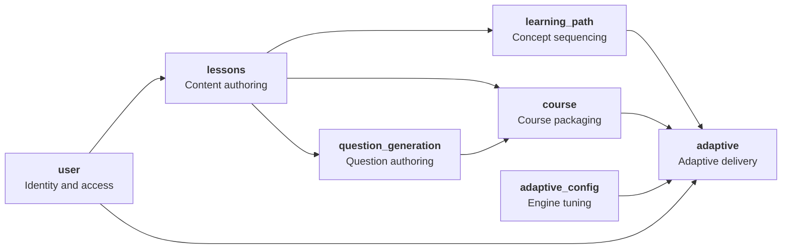

# MAVIA — Class Diagram, Entity-Relationship Diagram, and User Interface Specification

**System:** MAVIA — an adaptive audio learning platform for young blind and visually impaired students
**Repository:** `k:\STUDIO\mavia`
**Components:** Django REST backend · React (Vite) web application · Expo/React Native mobile application
**Document date:** 20 September 2026

---

## How to use this document

| Part | Contents |
|---|---|
| **Part I** | Class diagram of the system's domain model, with a narrative explaining every class and relationship |
| **Part II** | Entity-Relationship Diagram of the database, with a narrative explaining every table, key, and constraint |
| **Part III** | User interface description of every screen in the **web application** |
| **Part IV** | User interface description of every screen in the **mobile application** |

Diagrams are written in **Mermaid**. Paste any diagram block into
[mermaid.live](https://mermaid.live), a GitHub Markdown file, or a Mermaid-enabled
editor to render it as an image. All screen descriptions in Parts III and IV are
written as finished prose and can be pasted directly into a report without editing.

---
---

# Part I — Class Diagram

## I.1 System packages

MAVIA's domain model is organised into seven packages. Each package owns one
stage of the journey from an uploaded PDF to an adaptive audio lesson.

| Package | Responsibility |
|---|---|
| `user` | Accounts, roles, email verification, role-specific profiles |
| `lessons` | Courses, uploaded PDFs, the topic outline, and the content extracted from PDFs |
| `question_generation` | Machine-generated questions and the traceable runs that produced them |
| `learning_path` | Prerequisite relationships between concepts, and the published teaching order |
| `course` | The packaged, student-ready course: modules, lessons, and narration variants |
| `adaptive` | Enrolment, each learner's live position and mastery, and every answer given |
| `adaptive_config` | The tunable weights of the knowledge-tracing model |

---

## I.2 Full class diagram

```mermaid
classDiagram
    direction LR

    namespace user {
        class User {
            +int id
            +String username
            +String email
            +String password
            +String first_name
            +String last_name
            +Role role
            +bool is_verified
            +bool is_active
            +DateTime date_joined
        }
        class EmailVerificationToken {
            +int id
            +String token
            +DateTime created_at
            +DateTime expires_at
            +is_expired() bool
        }
        class StudentProfile {
            +User user
        }
        class TeacherProfile {
            +User user
        }
        class AdminProfile {
            +User user
        }
    }

    namespace lessons {
        class CourseGroup {
            +int id
            +String title
            +String description
            +DateTime created_at
            +DateTime updated_at
        }
        class CourseOutline {
            +int id
            +UUID metadata_id
            +File outline_file
            +String file_sha256
            +bool is_approved
            +DateTime uploaded_at
            +DateTime approved_at
        }
        class OutlineNode {
            +int id
            +String title
            +JSON related_info
            +int order
            +int depth
            +bool published
            +DateTime published_at
        }
        class LearningMaterial {
            +int id
            +UUID metadata_id
            +String title
            +File pdf_file
            +String file_sha256
            +Text extracted_text
            +JSON generated_json
            +Status status
            +Text error_message
            +DateTime created_at
            +clean() void
        }
        class LearningObjectGroup {
            +int id
            +String label
            +JSON version_selection
            +DateTime created_at
        }
        class LearningObject {
            +int id
            +UUID metadata_id
            +Kind kind
            +String section_title
            +String title
            +Text content
            +String image_url
            +int source_page
            +int order
            +String grouping_content_hash
            +current_grouping_fingerprint() String
            +mark_grouping_current() void
        }
        class LearningObjectMatchSuggestion {
            +int id
            +float similarity_score
            +Confidence confidence
            +JSON evidence
            +Status status
            +DateTime created_at
            +clean() void
        }
        class Question {
            +int id
            +Text prompt
            +Type question_type
            +JSON choices
            +Text correct_answer
            +String bloom_level
            +String thinking_order
            +String difficulty
            +SourceType source_type
            +ValidationStatus validation_status
            +JSON validation_issues
            +int order
        }
        class QuestionLearningObjectLink {
            +int id
            +float relevance_score
            +String method
            +bool is_primary
            +ReviewStatus review_status
            +DateTime reviewed_at
        }
    }

    namespace question_generation {
        class GeneratedQuestion {
            +int id
            +Text question_text
            +Format question_format
            +JSON choices
            +String correct_answer
            +Text explanation
            +String bloom_level
            +String difficulty
            +ThinkingOrder thinking_order
            +String category
            +Status status
            +String generation_fingerprint
            +DateTime created_at
        }
        class GenerationRun {
            +int id
            +Kind kind
            +Status status
            +DateTime started_at
            +DateTime finished_at
        }
        class GenerationEvent {
            +int id
            +int seq
            +String event_type
            +Text message
            +JSON data
            +DateTime created_at
        }
        class LearnerResponse {
            +int id
            +String learner_id
            +String selected_answer
            +bool is_correct
            +DateTime answered_at
        }
    }

    namespace learning_path {
        class ConceptPrerequisite {
            +int id
            +Status status
            +Source source
            +bool cross_section
            +JSON evidence
            +DateTime decided_at
            +DateTime created_at
        }
        class LearningPathStep {
            +int id
            +int position
            +int depth
            +DateTime published_at
        }
    }

    namespace course {
        class CourseModule {
            +int id
            +bool is_active
            +sequence_order() int
            +title() String
        }
        class LessonNode {
            +int id
            +title() String
            +learning_objects() List
        }
        class LessonVariant {
            +int id
            +Variant variant
            +Text narration
            +String audio_url
            +Origin origin
            +AssignedBy assigned_by
            +String generator_model
            +DateTime generated_at
        }
        class ModuleQuestion {
            +int id
            +int order
            +bloom_level() String
            +difficulty() String
        }
    }

    namespace adaptive {
        class Enrollment {
            +int id
            +DateTime created_at
        }
        class LearningState {
            +int id
            +int current_step_position
            +JSON remediation_stack
            +JSON remediated_positions
            +Variant current_variant
            +int current_question_attempts
            +DateTime attempt_started_at
            +JSON concept_mastery
            +float mastery
            +int attempts
            +bool completed
            +DateTime started_at
            +DateTime updated_at
        }
        class StudentResponse {
            +int id
            +String selected_answer
            +bool is_correct
            +int step_position
            +String variant
            +int attempt_number
            +int remediation_depth
            +String concept_key
            +float concept_mastery_before
            +float concept_mastery_after
            +Action action
            +int next_step_position
            +String next_variant
            +DateTime created_at
        }
    }

    namespace adaptive_config {
        class AdaptiveConfig {
            +int id
            +float p_guess
            +float p_slip
            +float p_learn
            +float mastery_ceiling
            +float starting_mastery
            +Difficulty default_difficulty
            +DateTime updated_at
            +load() AdaptiveConfig
        }
    }

    User "1" --> "0..1" EmailVerificationToken : verified by
    User "1" --> "0..1" StudentProfile : extended by
    User "1" --> "0..1" TeacherProfile : extended by
    User "1" --> "0..1" AdminProfile : extended by
    User "1" --> "0..*" Enrollment : is enrolled through
    User "1" --> "0..*" LearningState : progresses in
    User "1" --> "0..1" AdaptiveConfig : last tuned

    CourseGroup "1" *-- "0..*" CourseOutline : uploaded for
    CourseGroup "1" *-- "0..*" OutlineNode : structured by
    CourseGroup "1" *-- "0..*" LearningMaterial : sourced from
    CourseGroup "1" --> "0..*" Enrollment : rosters
    CourseGroup "1" --> "0..*" LearningState : tracked per learner

    OutlineNode "0..1" --> "0..*" OutlineNode : parent of
    OutlineNode "1" --> "0..*" LearningMaterial : holds
    OutlineNode "1" *-- "0..*" LearningObjectGroup : scopes
    OutlineNode "1" *-- "0..*" ConceptPrerequisite : scopes
    OutlineNode "1" *-- "0..*" LearningPathStep : publishes
    OutlineNode "1" *-- "0..*" LearningObjectMatchSuggestion : scopes
    OutlineNode "1" --> "0..1" CourseModule : packaged as

    LearningMaterial "1" *-- "0..*" LearningObject : extracted into
    LearningMaterial "1" *-- "0..*" Question : extracted into
    LearningMaterial "1" --> "0..1" LessonNode : packaged as
    LearningMaterial "1" --> "0..*" GenerationRun : processed by

    LearningObjectGroup "1" o-- "0..*" LearningObject : groups
    LearningObject "0..1" --> "0..*" LearningObject : represents
    LearningObject "1" --> "0..*" GeneratedQuestion : assessed by
    LearningObject "1" --> "0..*" LessonVariant : re-told as
    LearningObject "1" --> "0..*" QuestionLearningObjectLink : linked by
    LearningObject "1" --> "0..*" LearningObjectMatchSuggestion : suggested from

    Question "1" *-- "0..*" QuestionLearningObjectLink : paired through
    Question "0..1" --> "0..1" GeneratedQuestion : mirrors

    GeneratedQuestion "1" --> "0..*" ModuleQuestion : scheduled by
    GeneratedQuestion "1" --> "0..*" LearnerResponse : answered as
    GeneratedQuestion "1" --> "0..*" StudentResponse : answered as
    GenerationRun "1" *-- "0..*" GenerationEvent : traced by

    LearningObjectGroup "1" --> "0..*" ConceptPrerequisite : is prerequisite in
    LearningObjectGroup "1" --> "0..1" LearningPathStep : taught at

    CourseModule "1" *-- "0..*" LessonNode : contains
    LessonNode "1" *-- "0..*" ModuleQuestion : quizzed by

    LearningState "1" *-- "0..*" StudentResponse : records
    LearningState "1" --> "0..1" OutlineNode : current module
    LearningState "1" --> "0..1" OutlineNode : current topic
    LearningState "1" --> "0..1" Question : current question
    LearningState "1" --> "0..1" GeneratedQuestion : current step question
    LearningState "1" --> "0..1" LearningObject : current chunk
```

---

## I.3 Class diagram narrative

### I.3.1 Identity and access

The system has a **single user table**. `User` extends Django's
`AbstractUser` and adds two fields of its own: a `role` (Admin, Teacher, or
Student) and an `is_verified` flag. Login is refused until `is_verified` is
true, which is what makes email verification mandatory rather than advisory.

Verification is carried by `EmailVerificationToken`, which holds a one-to-one
relationship to `User`. A token stores an opaque random string and an expiry
timestamp, and exposes `is_expired()` so the verification endpoint can
distinguish "wrong token" from "correct but stale token".

`StudentProfile`, `TeacherProfile`, and `AdminProfile` are thin one-to-one
extensions of `User`. They exist so that role-specific attributes can be added
later without widening the `User` table or forcing a migration on every account
in the system. Each uses its `user` field as its own primary key, so a profile
cannot exist without the account it belongs to.

**Design note.** Role is stored as a field rather than as a class hierarchy.
This keeps authentication and token issuance uniform across all three roles —
one login endpoint, one token table — while the web and mobile clients decide
what each role is allowed to see.

### I.3.2 Content authoring

A `CourseGroup` is a course. It is the top of the content hierarchy and the
unit that students enrol into.

A teacher uploads two kinds of PDF against a course.

The first is a **course outline**, stored as a `CourseOutline`. MAVIA extracts
a topic hierarchy from it and writes that hierarchy as a tree of
`OutlineNode` records. `OutlineNode` is self-referential: a node with no
`parent` is a **module**, and its children are **topics**. The node carries
`order` and `depth` so the tree can be rendered and walked without recursion,
and a `published` flag that marks the topic as ready for students. A course
outline is stored with a SHA-256 hash of the uploaded file so the same file
cannot be uploaded twice into the same course.

The second is a **learning material** — a lesson PDF — stored as a
`LearningMaterial`. It is attached to a course and to the outline node whose
topic it teaches. Its `status` field (`processing`, `completed`, `failed`)
tracks the extraction pipeline, and `error_message` explains a failure to the
teacher. The extracted raw text is kept on the record, and `generated_json`
holds the pipeline's working output, including the narration playlist.

Extraction breaks each PDF into `LearningObject` records: individual passages
or images, each with a title, content, source page, and position within the
document. A learning object is the smallest unit MAVIA teaches.

Because a topic is typically covered by **several** PDFs, the same idea is often
explained more than once. `LearningObjectGroup` is what unifies them: it is a
set of learning objects from different PDFs that all teach the same concept.
The group is deliberately neutral — it carries no difficulty label and no
teaching order — because those decisions belong to the learning-path stage.

Grouping is proposed automatically and confirmed by a teacher. Each proposal is
a `LearningObjectMatchSuggestion` holding a similarity score, a confidence band,
the evidence behind the match, and a status of pending, accepted, or rejected.
When a match is accepted, one object becomes the group's **representative** and
the others point at it through `LearningObject.represented_by`, a
self-referential link. The represented objects are kept, not deleted, so an
automatic grouping decision always remains reversible.

`LearningObject.grouping_content_hash` records the exact text an object had when
its grouping was last decided. If a teacher later edits that text, the hash no
longer matches, and the system can surface a "review grouping changes" prompt
instead of silently leaving the object in a group it may no longer belong to.

`Question` holds a question **detected inside an uploaded PDF**, kept separate
from lesson content so that source material and assessment never mix. Its
`validation_status` marks whether it is ready to use or still needs a teacher's
eye. A question is connected to the content it assesses through
`QuestionLearningObjectLink`, an association class that records how confident
the pairing is (`relevance_score`), how it was made (`method`), whether it is
the primary pairing, and what a teacher decided about it (`review_status`). A
database constraint guarantees at most one primary learning object per question.

### I.3.3 Question generation

`GeneratedQuestion` is a question written by the language model rather than
lifted from a PDF. It belongs to one `LearningObject` — the passage it
assesses — and carries the question text, format (multiple choice or
true/false), choices, correct answer, and an explanation.

Each generated question is classified on two independent axes.
`bloom_level` and the derived `thinking_order` (Lower Order or Higher Order
Thinking) record **what kind of thinking** the question demands, and are what
the generation pipeline balances its output across. `difficulty` (easy,
medium, hard) is a separate axis kept for the adaptive engine, which needs a
level it can step *down* to after a wrong answer.

Questions are written to the database as `draft` the moment the model returns
them, then classified, deduplicated, and trimmed by a separate deterministic
pass that promotes the survivors to `final`. Only `final` rows are ever shown
to a teacher or served to a learner. A `generation_fingerprint` — a hash of the
source content and the full generation configuration — lets a later run reuse an
existing question bank instead of regenerating it.

`GenerationRun` and `GenerationEvent` make every pipeline execution traceable.
A run records its `kind` (PDF extraction, question generation, topic publish, or
content-version classification), its status, and its start and finish times. A
run's `kind` is not decoration: question generation refuses to start while
another question-generation run is live, and without a kind an unrelated
extraction run would trigger a false conflict. `GenerationEvent` rows are the
ordered trace entries the teacher's progress view polls and displays.

`LearnerResponse` is a lightweight answer log from the question-generation
prototype. It identifies the learner by a plain string (`learner_id`) rather
than a foreign key, and is kept separate from the adaptive engine's own
`StudentResponse`.

### I.3.4 Learning path

`ConceptPrerequisite` states that one concept must be learned before another:
"learn `prerequisite` before `dependent`", where both are
`LearningObjectGroup` records within the same topic.

Each row records both a `status` and a `source`. The status is `accepted`
(the automatic criteria were confident), `pending` (proposed but unconfirmed),
`approved` (a teacher said yes), or `rejected` (a teacher said no). Only
`accepted` and `approved` rows shape the published path. Pending rows are
stored but hidden from teachers by default, because a blind hand-check showed
most of them to be wrong.

Teacher decisions outlive re-derivation. Re-publishing a topic recomputes the
derived rows but never touches an `approved` or `rejected` one, so a pair a
teacher has already turned down is never proposed to them again. The `evidence`
field keeps the votes and scores behind a derived row, so a decision can be
explained afterwards and a later scoring change can be compared without
re-deriving everything.

Two constraints protect the graph: a pair of concepts may appear only once, and
a concept may never be its own prerequisite.

`LearningPathStep` is the **published result** of resolving that graph into a
teaching order. Each step ties an outline node to one concept at a given
`position`, with a `depth` recording how many prerequisite links lead to it at
most. Steps at the same depth do not depend on one another. The whole set of
steps for a topic is replaced wholesale on each successful publish, so students
always follow a path that matches the content currently visible to them. Unique
constraints guarantee that a topic has no two steps at the same position, and no
concept appearing twice.

### I.3.5 Course packaging

The `course` package turns reviewed content into the student-ready package the
mobile application plays.

`CourseModule` wraps a top-level `OutlineNode` in a one-to-one relationship and
adds an `is_active` flag. It derives its title and sequence order from the
outline node rather than duplicating them, so renaming a module in the outline
renames it everywhere.

`LessonNode` wraps a `LearningMaterial` one-to-one and belongs to a
`CourseModule`. Both teaching and questioning step through the lesson's
learning objects in order.

`LessonVariant` holds an alternative telling of one learning object. The
variant slot is `SIMPLIFIED` or `ELABORATED`, and each row carries the
narration text and the URL of its generated audio. `origin` distinguishes a
variant taken from another source PDF's own wording from one written by the
model, and `assigned_by` records whether the slot was proposed by the
readability heuristic, proposed by the model and validated by readability rules,
or confirmed by a teacher. A database constraint allows at most one simplified
and one elaborated version per learning object. Unmatched PDF wording remains
unassigned for teacher review. The **Normal** version is
not a `LessonVariant` row at all — it is the learning object's own content, read
out of the material's generated playlist.

`ModuleQuestion` schedules a `GeneratedQuestion` into a `LessonNode` at a given
order. It validates on save that the question's learning object actually belongs
to that lesson node's material, so a question can never be scheduled against
content the student will not have heard.

### I.3.6 Adaptive delivery

`Enrollment` is a student's membership in a course — a simple pairing of a
student and a `CourseGroup`, unique per pair, with a record of who created it.
Teachers manage the roster from the web application, and the per-student
progress report is scoped to these rows.

`LearningState` is the heart of the engine: **one row per student per course**,
holding where the learner currently is and how well they are doing. It operates
in one of two modes, and the two never populate at the same time.

- **Plain mode** walks a topic's content in PDF order. The state's position is
  held in `current_module`, `current_lesson_node`, and `current_question`.
- **Path mode** follows a published learning path. The position is held in
  `current_step_position` and `current_generated_question` instead, and is used
  whenever the current topic has a published path.

In path mode, three further fields govern remediation. `remediation_stack` is a
stack of steps to return to, pushed on every detour into a prerequisite and
popped once that prerequisite is fully answered; each entry also records which
learning object the resumed step was showing, so resuming knows whether an
unused alternative is still available. `remediated_positions` records which
step positions have already spent their one permitted detour, which the stack
alone cannot do — the stack is *popped* on resume, so without this record a
learner who keeps missing the same step would loop through the same
prerequisite forever. `current_chunk` names which learning object is currently
supplying the content: null means the concept's representative, and an id means
the engine has exhausted that representative's own explanations and switched to
another PDF's telling of the same idea. `current_variant` says which
explanation level is being used — normal, simplified, or elaborated.

Mastery is tracked at two grains. `mastery` is a single course-wide score and is
what teacher reports read. `concept_mastery` is a JSON map holding the same
Bayesian update applied per concept, with namespaced keys —
`concept:<LearningObjectGroup id>` in path mode and `topic:<OutlineNode id>` in
plain mode — because the two modes count different things and their numeric ids
would otherwise collide. A key is absent until its first answer, at which point
its prior is the configured starting mastery.

`attempt_started_at` marks when the current run at the current topic began.
Answers are kept forever because the teacher report reads them, but only those
from the current attempt count as "already cleared". Without this, a student who
finished a topic and opened it again would be advanced straight past every step
they had ever answered and arrive at the end without being taught anything.

`StudentResponse` is a full **decision log**, not merely an answer record. Each
row captures one complete transition: where the learner was and what they were
being shown when they answered (step position, variant, chunk, attempt number,
remediation depth), the concept the question was about and its mastery on either
side of the answer, what the engine decided (`action`), and where that decision
left them (next step position, next variant, next chunk). The `action` values —
next question, advance, resume, complete, escalate variant, detour prerequisite,
switch source, second pass, retry — are the complete vocabulary of the adaptive
engine's behaviour. Exactly one of `question` or `generated_question` is set on
each row, matching the state's mode, and a check constraint enforces this.

### I.3.7 Engine configuration

`AdaptiveConfig` is a **singleton** — its `save()` forces the primary key to 1,
and `load()` fetches or creates that one row. It holds the six weights of the
Bayesian Knowledge Tracing model: `p_guess` (the chance of answering correctly
without knowing), `p_slip` (the chance of answering wrongly while knowing),
`p_learn` (the chance of learning the concept from one question),
`starting_mastery`, `mastery_ceiling`, and the `default_difficulty` used to pick
the first question of a tier. All probabilities are validated to the range 0–1.
The class exists so an administrator can tune the engine from the web interface
without a code change or a redeployment, and it records who last changed it.

---
---

# Part II — Entity-Relationship Diagram

## II.1 Full ERD

```mermaid
erDiagram
    USER ||--o| EMAIL_VERIFICATION_TOKEN : "verifies via"
    USER ||--o| STUDENT_PROFILE : "extends to"
    USER ||--o| TEACHER_PROFILE : "extends to"
    USER ||--o| ADMIN_PROFILE : "extends to"
    USER ||--o{ ENROLLMENT : "enrolls via"
    USER ||--o{ LEARNING_STATE : "progresses in"
    USER |o--o{ ADAPTIVE_CONFIG : "last updated by"

    COURSE_GROUP ||--o{ COURSE_OUTLINE : "has"
    COURSE_GROUP ||--o{ OUTLINE_NODE : "has"
    COURSE_GROUP ||--o{ LEARNING_MATERIAL : "has"
    COURSE_GROUP ||--o{ ENROLLMENT : "rosters"
    COURSE_GROUP ||--o{ LEARNING_STATE : "is tracked in"

    OUTLINE_NODE |o--o{ OUTLINE_NODE : "parent of"
    OUTLINE_NODE ||--o{ LEARNING_MATERIAL : "holds"
    OUTLINE_NODE ||--o{ LEARNING_OBJECT_GROUP : "scopes"
    OUTLINE_NODE ||--o{ LEARNING_OBJECT_MATCH_SUGGESTION : "scopes"
    OUTLINE_NODE ||--o{ CONCEPT_PREREQUISITE : "scopes"
    OUTLINE_NODE ||--o{ LEARNING_PATH_STEP : "publishes"
    OUTLINE_NODE ||--o{ GENERATION_RUN : "publishes via"
    OUTLINE_NODE ||--o| COURSE_MODULE : "is packaged as"

    LEARNING_MATERIAL ||--o{ LEARNING_OBJECT : "extracts"
    LEARNING_MATERIAL ||--o{ QUESTION : "extracts"
    LEARNING_MATERIAL ||--o{ GENERATION_RUN : "is processed by"
    LEARNING_MATERIAL ||--o| LESSON_NODE : "is packaged as"

    LEARNING_OBJECT_GROUP ||--o{ LEARNING_OBJECT : "groups"
    LEARNING_OBJECT_GROUP ||--o{ CONCEPT_PREREQUISITE : "is prerequisite in"
    LEARNING_OBJECT_GROUP ||--o{ CONCEPT_PREREQUISITE : "is dependent in"
    LEARNING_OBJECT_GROUP ||--o| LEARNING_PATH_STEP : "is taught at"

    LEARNING_OBJECT |o--o{ LEARNING_OBJECT : "represents"
    LEARNING_OBJECT ||--o{ GENERATED_QUESTION : "is assessed by"
    LEARNING_OBJECT ||--o{ LESSON_VARIANT : "is retold as"
    LEARNING_OBJECT ||--o{ QUESTION_LEARNING_OBJECT_LINK : "is linked by"
    LEARNING_OBJECT ||--o{ LEARNING_OBJECT_MATCH_SUGGESTION : "is source of"
    LEARNING_OBJECT ||--o{ LEARNING_OBJECT_MATCH_SUGGESTION : "is candidate of"
    LEARNING_OBJECT ||--o{ LEARNING_STATE : "is current chunk of"
    LEARNING_OBJECT ||--o{ STUDENT_RESPONSE : "is logged chunk of"

    QUESTION ||--o{ QUESTION_LEARNING_OBJECT_LINK : "pairs via"
    QUESTION |o--o| GENERATED_QUESTION : "mirrors"
    QUESTION ||--o{ LEARNING_STATE : "is current question of"
    QUESTION ||--o{ STUDENT_RESPONSE : "is answered in"

    GENERATED_QUESTION ||--o{ MODULE_QUESTION : "is scheduled as"
    GENERATED_QUESTION ||--o{ LEARNER_RESPONSE : "is answered as"
    GENERATED_QUESTION ||--o{ STUDENT_RESPONSE : "is answered in"
    GENERATED_QUESTION ||--o{ LEARNING_STATE : "is current step question of"

    GENERATION_RUN ||--o{ GENERATION_EVENT : "traces"

    COURSE_MODULE ||--o{ LESSON_NODE : "contains"
    LESSON_NODE ||--o{ MODULE_QUESTION : "is quizzed by"

    LEARNING_STATE ||--o{ STUDENT_RESPONSE : "records"
```

## II.2 Table attribute reference

The diagram above shows relationships. The tables below list the columns of
each entity, with `PK` for primary key, `FK` for foreign key, and `UK` for a
uniqueness constraint.

### user_user — USER

| Column | Type | Key | Notes |
|---|---|---|---|
| id | integer | PK | |
| username | varchar(150) | UK | |
| email | varchar(254) | | |
| password | varchar(128) | | Hashed |
| first_name, last_name | varchar(150) | | |
| role | varchar(20) | | `ADMIN` \| `TEACHER` \| `STUDENT` |
| is_verified | boolean | | Login is blocked while false |
| is_active, is_staff, is_superuser | boolean | | Django defaults |
| date_joined, last_login | datetime | | |

### user_emailverificationtoken — EMAIL_VERIFICATION_TOKEN

| Column | Type | Key | Notes |
|---|---|---|---|
| id | integer | PK | |
| user_id | integer | FK, UK | One live token per account |
| token | varchar(64) | UK | |
| created_at, expires_at | datetime | | |

### user_studentprofile / user_teacherprofile / user_adminprofile

| Column | Type | Key | Notes |
|---|---|---|---|
| user_id | integer | PK, FK | The profile *is* keyed by its user |

### lessons_coursegroup — COURSE_GROUP

| Column | Type | Key | Notes |
|---|---|---|---|
| id | integer | PK | |
| title | varchar(255) | | |
| description | text | | |
| created_at, updated_at | datetime | | |

### lessons_courseoutline — COURSE_OUTLINE

| Column | Type | Key | Notes |
|---|---|---|---|
| id | integer | PK | |
| metadata_id | uuid | UK | Stable external identifier |
| course_id | integer | FK | |
| outline_file | varchar(100) | | Path under `outlines/` |
| file_sha256 | varchar(64) | UK* | Unique per course when non-empty |
| is_approved | boolean | | Teacher has confirmed the hierarchy |
| uploaded_at, approved_at | datetime | | |

### lessons_outlinenode — OUTLINE_NODE

| Column | Type | Key | Notes |
|---|---|---|---|
| id | integer | PK | |
| course_id | integer | FK | |
| parent_id | integer | FK, null | Null = module; non-null = topic |
| title | varchar(255) | | |
| related_info | json | | |
| order | integer | UK* | Unique with (course, parent) |
| depth | smallint | | 0 for modules |
| published | boolean | | |
| published_at | datetime | | |

### lessons_learningmaterial — LEARNING_MATERIAL

| Column | Type | Key | Notes |
|---|---|---|---|
| id | integer | PK | |
| metadata_id | uuid | UK | |
| course_id | integer | FK | |
| outline_node_id | integer | FK, null | The topic this PDF teaches |
| module_node_id | integer | FK, null | Must be a top-level node |
| title | varchar(255) | | |
| pdf_file | varchar(100) | | Path under `learning_materials/` |
| file_sha256 | varchar(64) | UK* | Unique per course when non-empty |
| extracted_text | text | | |
| generated_json | json | | Pipeline output incl. narration playlist |
| status | varchar(20) | | `processing` \| `completed` \| `failed` |
| error_message | text | | |
| created_at | datetime | | |

### lessons_learningobjectgroup — LEARNING_OBJECT_GROUP

| Column | Type | Key | Notes |
|---|---|---|---|
| id | integer | PK | |
| outline_node_id | integer | FK | |
| label | varchar(255) | | Teacher-facing concept name |
| version_selection | json | | Which object fills each variant slot |
| created_at | datetime | | |

### lessons_learningobject — LEARNING_OBJECT

| Column | Type | Key | Notes |
|---|---|---|---|
| id | integer | PK | |
| metadata_id | uuid | UK | |
| material_id | integer | FK | |
| group_id | integer | FK, null | The concept it belongs to |
| represented_by_id | integer | FK, null | Self-reference to the group's representative |
| kind | varchar(20) | | `text` \| `image` |
| section_title, title | varchar(255) | | |
| content | text | | |
| image_url | varchar(500) | | |
| image_prompt | text | | |
| source_page, source_block_id | integer, null | | Provenance in the PDF |
| source_excerpt | text | | |
| order | integer | | Position within the material |
| grouping_content_hash | varchar(64) | | Text hash when grouping was decided |

### lessons_learningobjectmatchsuggestion — LEARNING_OBJECT_MATCH_SUGGESTION

| Column | Type | Key | Notes |
|---|---|---|---|
| id | integer | PK | |
| outline_node_id | integer | FK | |
| source_learning_object_id | integer | FK | UK with candidate |
| candidate_learning_object_id | integer | FK | Must differ from source |
| similarity_score | float | | |
| confidence | varchar(30) | | `high` \| `medium` \| `teacher_confirmed` |
| evidence | json | | Why the match was proposed |
| status | varchar(20) | | `pending` \| `accepted` \| `rejected` |
| created_at, updated_at | datetime | | |

### lessons_question — QUESTION

| Column | Type | Key | Notes |
|---|---|---|---|
| id | integer | PK | |
| material_id | integer | FK | |
| prompt | text | | |
| source_type | varchar(20) | | `pdf` \| `manual` \| `generated` |
| content_fingerprint | varchar(64) | | Deduplication hash |
| question_type | varchar(30) | | `open_ended` \| `true_false` \| `multiple_choice` |
| choices | json | | |
| correct_answer | text | | |
| bloom_level, thinking_order, difficulty, category | varchar | | Classification |
| validation_status | varchar(20) | | `ready` \| `needs_review` |
| validation_issues | json | | |
| adaptive_question_id | integer | FK, UK, null | Mirror of a generated question |
| order | integer | | |
| source_page, source_block_id, source_excerpt | | | Provenance |

### lessons_questionlearningobjectlink — QUESTION_LEARNING_OBJECT_LINK

| Column | Type | Key | Notes |
|---|---|---|---|
| id | integer | PK | |
| question_id | integer | FK | UK with learning_object |
| learning_object_id | integer | FK | |
| relevance_score | float | | |
| method | varchar(100) | | e.g. `layout_tfidf` |
| is_primary | boolean | UK* | At most one primary per question |
| review_status | varchar(30) | | auto-confirmed, pending, unmatched, teacher-confirmed, teacher-unpaired |
| reviewed_at | datetime, null | | |

### question_generation_generatedquestion — GENERATED_QUESTION

| Column | Type | Key | Notes |
|---|---|---|---|
| id | integer | PK | |
| node_id | integer | FK | The learning object assessed |
| question_text | text | | |
| question_format | varchar(3) | | `MCQ` \| `TF` |
| choices | json, null | | |
| correct_answer | varchar(255) | | |
| explanation | text | | |
| bloom_level | varchar(20) | idx | remember…create |
| difficulty | varchar(10) | idx | easy \| medium \| hard |
| thinking_order | varchar(3) | idx | `LOT` \| `HOT` |
| category | varchar(30) | | Facts, Meaning, Skills, Outcome |
| status | varchar(5) | idx | `draft` \| `final` — only final is served |
| generation_fingerprint | varchar(64) | idx | Source + config hash |
| created_at | datetime | | |

### question_generation_generationrun — GENERATION_RUN

| Column | Type | Key | Notes |
|---|---|---|---|
| id | integer | PK | |
| material_id | integer | FK, null | Set for extraction / question runs |
| node_id | integer | FK, null | Set when the run covered one object |
| outline_node_id | integer | FK, null | Set for a topic publish run |
| kind | varchar(12) | idx | extraction \| questions \| publish \| versions |
| status | varchar(10) | | running \| finished \| failed |
| started_at, finished_at | datetime | | |

### question_generation_generationevent — GENERATION_EVENT

| Column | Type | Key | Notes |
|---|---|---|---|
| id | integer | PK | |
| run_id | integer | FK | |
| seq | integer | idx | Ordering within the run |
| event_type | varchar(30) | | |
| message | text | | |
| data | json, null | | |
| created_at | datetime | | |

### question_generation_learnerresponse — LEARNER_RESPONSE

| Column | Type | Key | Notes |
|---|---|---|---|
| id | integer | PK | |
| learner_id | varchar(50) | idx | A plain string, **not** a foreign key |
| question_id | integer | FK | |
| selected_answer | varchar(255) | | |
| is_correct | boolean | | |
| answered_at | datetime | | |

### learning_path_conceptprerequisite — CONCEPT_PREREQUISITE

| Column | Type | Key | Notes |
|---|---|---|---|
| id | integer | PK | |
| outline_node_id | integer | FK | |
| prerequisite_id | integer | FK | UK with dependent; must differ from it |
| dependent_id | integer | FK | |
| status | varchar(10) | idx | accepted \| pending \| approved \| rejected |
| source | varchar(10) | | derived \| teacher |
| cross_section | boolean | | Concepts sit under unrelated headings |
| evidence | json | | Votes and scores behind the proposal |
| decided_at, created_at, updated_at | datetime | | |

### learning_path_learningpathstep — LEARNING_PATH_STEP

| Column | Type | Key | Notes |
|---|---|---|---|
| id | integer | PK | |
| outline_node_id | integer | FK | |
| concept_id | integer | FK | UK with outline_node |
| position | integer | UK* | Unique with outline_node |
| depth | smallint | | Longest prerequisite chain to this step |
| published_at | datetime | | |

### course_coursemodule — COURSE_MODULE

| Column | Type | Key | Notes |
|---|---|---|---|
| id | integer | PK | |
| source_id | integer | FK, UK, null | A top-level outline node |
| is_active | boolean | | |

### course_lessonnode — LESSON_NODE

| Column | Type | Key | Notes |
|---|---|---|---|
| id | integer | PK | |
| module_id | integer | FK | |
| source_id | integer | FK, UK | The learning material it wraps |

### course_lessonvariant — LESSON_VARIANT

| Column | Type | Key | Notes |
|---|---|---|---|
| id | integer | PK | |
| learning_object_id | integer | FK | UK with variant |
| variant | varchar(20) | | `ELABORATED` \| `SIMPLIFIED` |
| narration | text | | |
| audio_url | varchar(255) | | |
| source_fingerprint | varchar(64) | | |
| generator_model | varchar(100) | | |
| generated_at | datetime, null | | |
| origin | varchar(20) | | source_pdf \| generated |
| source_learning_object_id | integer | FK, null | Which PDF supplied the wording |
| assigned_by | varchar(20) | | heuristic \| llm_validated \| teacher |

### course_modulequestion — MODULE_QUESTION

| Column | Type | Key | Notes |
|---|---|---|---|
| id | integer | PK | |
| lesson_node_id | integer | FK | UK with question |
| question_id | integer | FK | A generated question |
| order | integer | | |

### adaptive_enrollment — ENROLLMENT

| Column | Type | Key | Notes |
|---|---|---|---|
| id | integer | PK | |
| student_id | integer | FK | UK with course; role must be STUDENT |
| course_id | integer | FK | |
| created_at | datetime | | |
| created_by_id | integer | FK, null | Usually the teacher |

### adaptive_learningstate — LEARNING_STATE

| Column | Type | Key | Notes |
|---|---|---|---|
| id | integer | PK | |
| student_id | integer | FK | UK with course — one state per pair |
| course_id | integer | FK | |
| current_module_id | integer | FK, null | Plain mode |
| current_lesson_node_id | integer | FK, null | Plain mode |
| current_question_id | integer | FK, null | Plain mode |
| current_step_position | integer, null | | Path mode |
| current_generated_question_id | integer | FK, null | Path mode |
| remediation_stack | json | | Steps to resume after a detour |
| remediated_positions | json | | Positions that already used their detour |
| current_chunk_id | integer | FK, null | Null = the concept's representative |
| current_variant | varchar(10) | | normal \| simplified \| elaborated |
| current_question_attempts | integer | | |
| attempt_started_at | datetime | | Start of the current run at this topic |
| concept_mastery | json | | Per-concept scores, namespaced keys |
| mastery | float | | Course-wide score; what reports read |
| attempts | integer | | |
| completed | boolean | | |
| started_at, updated_at | datetime | | |

### adaptive_studentresponse — STUDENT_RESPONSE

| Column | Type | Key | Notes |
|---|---|---|---|
| id | integer | PK | |
| learning_state_id | integer | FK | |
| question_id | integer | FK, null | Exactly one of these two is set |
| generated_question_id | integer | FK, null | |
| selected_answer | varchar(255) | | |
| is_correct | boolean | | |
| step_position | integer, null | | State before the answer |
| variant | varchar(10) | | |
| chunk_id | integer | FK, null | |
| attempt_number | integer, null | | |
| remediation_depth | smallint, null | | |
| concept_key | varchar(40) | | `concept:<id>` or `topic:<id>` |
| concept_mastery_before / _after | float, null | | |
| action | varchar(24) | | The engine's decision |
| next_step_position | integer, null | | State after the answer |
| next_variant | varchar(10) | | |
| next_chunk_id | integer | FK, null | |
| created_at | datetime | | |

### adaptive_config_adaptiveconfig — ADAPTIVE_CONFIG

| Column | Type | Key | Notes |
|---|---|---|---|
| id | smallint | PK | Always 1 — enforced in `save()` |
| p_guess, p_slip, p_learn | float | | Range 0–1 |
| starting_mastery, mastery_ceiling | float | | Range 0–1 |
| default_difficulty | varchar(10) | | easy \| medium \| hard |
| updated_at | datetime | | |
| updated_by_id | integer | FK, null | |

---

## II.3 ERD narrative

### II.3.1 Overall shape

The database has **twenty-seven application tables** across seven Django
applications. Its shape is a funnel: a wide authoring side where teachers turn
PDFs into reviewed content, narrowing to a single published teaching order per
topic, then widening again on the delivery side where each learner accumulates
their own state and answer history.

Three tables are the hinges of the whole schema:

- `lessons_outlinenode` — every piece of content, every prerequisite, and every
  published path hangs off a topic node.
- `lessons_learningobject` — the smallest unit of content; questions, narration
  variants, and the learner's current position all point at one.
- `adaptive_learningstate` — one row per student per course, holding everything
  the engine needs to decide what to show next.

### II.3.2 Identity

`user_user` is the single account table for all three roles. It is referenced
by the three profile tables, each of which uses `user_id` as its own primary
key, giving a strict one-to-one relationship with no orphans possible.
`user_emailverificationtoken` also holds a one-to-one relationship, so issuing a
new token replaces rather than accumulates.

`user_user` is referenced from the delivery side by `adaptive_enrollment` and
`adaptive_learningstate`, and once from configuration by
`adaptive_config_adaptiveconfig.updated_by_id`, which is nullable and set to
null on delete so that removing an administrator never destroys the engine
settings.

### II.3.3 The content hierarchy

`lessons_coursegroup` is the root. Beneath it:

`lessons_courseoutline` holds uploaded outline PDFs. A partial unique
constraint on `(course_id, file_sha256)`, applied only when the hash is
non-empty, prevents the same file being uploaded twice into one course while
still allowing legacy rows with no hash.

`lessons_outlinenode` is the topic tree, made self-referential by a nullable
`parent_id`. A row with `parent_id IS NULL` is a **module**; its children are
**topics**. `(course_id, parent_id, order)` is unique, so two siblings can never
occupy the same slot. `depth` is denormalised alongside `parent_id` so the tree
can be sorted and displayed with a single flat query.

`lessons_learningmaterial` holds lesson PDFs. It carries two separate foreign
keys into the outline: `outline_node_id` for the topic it teaches, and
`module_node_id` for the module it sits under. Model-level validation enforces
that `module_node_id` refers to a genuinely top-level node of the same course.
The same partial hash constraint prevents duplicate uploads.

`lessons_learningobject` holds the passages extracted from a material. Two of
its foreign keys are the interesting ones. `group_id` points at the concept the
passage teaches and is nullable, because a passage exists before grouping runs;
it is set to null rather than cascading on delete, so removing a group never
destroys content. `represented_by_id` is a self-reference marking that another
object already teaches this same concept; represented rows are retained so an
automatic grouping decision stays reversible.

`lessons_learningobjectgroup` is the concept itself. It holds only a label and a
`version_selection` map, which records which member object fills the simplified
and elaborated slots. Deliberately, it carries no difficulty and no ordering —
those belong to the learning-path tables.

`lessons_learningobjectmatchsuggestion` records the cross-PDF match proposals
behind grouping. It is unique on `(source, candidate)` and constrained so the
two may never be the same row. Model validation additionally requires that the
two objects come from *different* PDFs, belong to the suggestion's topic, and
share a content kind.

### II.3.4 Questions

Questions live in two tables because they have two origins.

`lessons_question` holds a question found **inside** an uploaded PDF. It belongs
to the material it came from and is joined to the content it assesses through
`lessons_questionlearningobjectlink`, a proper association table with its own
attributes. Two constraints govern that table: `(question_id,
learning_object_id)` is unique, and a partial unique index on `question_id`
where `is_primary` is true guarantees at most one primary pairing per question.

`question_generation_generatedquestion` holds a question **written by the
model**. It belongs directly to a single learning object. Its `status` column
is the critical one: rows are written as `draft` and only promoted to `final`
after classification and deduplication, and every read path that serves a
learner or a teacher filters on `status = 'final'`. Three composite indexes —
`(node, difficulty)`, `(node, thinking_order)`, and `(node, status)` — support
the engine's question selection, which always queries by learning object plus a
classification axis.

The two tables meet at `lessons_question.adaptive_question_id`, a nullable
one-to-one link used when a PDF question is mirrored into the adaptive bank.

`question_generation_generationrun` records each pipeline execution and carries
three mutually exclusive nullable foreign keys, because one table serves four
kinds of run: `material_id` alone for a whole-material run, `material_id` plus
`node_id` for a single-object run, and `outline_node_id` for a topic publish.
The `kind` column scopes the "is another run already live?" check so unrelated
pipelines do not block one another. `question_generation_generationevent` holds
the ordered trace entries, indexed on `(run_id, seq)` for the progress view's
polling.

`question_generation_learnerresponse` is the only table in the schema that
identifies a learner by a **plain string rather than a foreign key**. It belongs
to the question-generation prototype and is intentionally decoupled from the
adaptive engine's own answer log.

### II.3.5 Learning path

`learning_path_conceptprerequisite` is a directed edge between two concepts.
Both `prerequisite_id` and `dependent_id` are foreign keys into
`lessons_learningobjectgroup`, which is why the ERD shows two separate
relationships between the same pair of tables. A unique constraint on the pair
prevents duplicate edges, and a check constraint prevents an edge from a concept
to itself. `status` is indexed because every path derivation filters on it.

`learning_path_learningpathstep` is the resolved teaching order. Two unique
constraints do the work: `(outline_node_id, position)` means no topic has two
steps in the same slot, and `(outline_node_id, concept_id)` means no concept is
taught twice in one topic. The whole step set for a topic is deleted and
rewritten on each successful publish, which is why `published_at` is stored on
each row rather than only on the topic.

### II.3.6 Course packaging

`course_coursemodule` and `course_lessonnode` are both **wrapper tables** with
one-to-one links back into `lessons` — to an outline node and a learning
material respectively. They add packaging-specific state (`is_active`, module
membership) without duplicating title or ordering, which are read through the
wrapped row.

`course_lessonvariant` stores alternative narrations of a learning object. Its
constraint is a unique index on `(learning_object_id, variant)`: an object may
have one simplified and one elaborated version. Note that there is **no row for
the Normal version** — that text is the learning object's own content, read from
the material's `generated_json` playlist.

`course_modulequestion` schedules a generated question into a lesson node, unique
per `(lesson_node_id, question_id)`, with model-level validation ensuring the
question's learning object genuinely belongs to that lesson's material.

### II.3.7 Delivery and logging

`adaptive_enrollment` is the roster: unique on `(student_id, course_id)`, with
the student restricted to the STUDENT role and a nullable `created_by_id`
recording the teacher who added them.

`adaptive_learningstate` is unique on `(student_id, course_id)`. It holds two
alternative position triples — the plain-mode trio of module, lesson node, and
question, and the path-mode pair of step position and generated question — and
only one set is ever populated for a given row. Its three JSON columns carry
structures that would otherwise need their own tables: `remediation_stack` (an
ordered stack of pending resumes), `remediated_positions` (a set of positions
that have spent their detour), and `concept_mastery` (a map from namespaced
concept key to score). They are JSON because they are read and written whole on
every answer, are meaningless outside their parent row, and are never queried
across learners.

`adaptive_studentresponse` is the append-only decision log. It holds two
nullable question foreign keys with a check constraint —
`student_response_exactly_one_question_type` — guaranteeing that exactly one is
set, matching the mode the state was in. Every other column beyond the answer
itself is nullable, so rows written before the decision log existed remain
valid. The row captures the before state, the concept and its mastery either
side, the engine's `action`, and the after state, which together allow the full
adaptive session to be replayed from the database alone.

`adaptive_config_adaptiveconfig` is a single-row table. Its primary key is a
small integer forced to 1 on every save, so the table cannot acquire a second
configuration no matter how it is written to.

### II.3.8 Deletion behaviour

Deletion rules encode what the system considers disposable.

**Cascade** is used down the ownership chain: deleting a course removes its
outlines, nodes, and materials; deleting a material removes its learning
objects and questions; deleting a learning state removes its responses.

**Set null** is used wherever a reference is a *pointer*, not ownership:
`LearningObject.group_id` and `.represented_by_id`, every positional pointer on
`LearningState`, the chunk references on `StudentResponse`, `Enrollment.
created_by_id`, `LessonVariant.source_learning_object_id`,
`Question.adaptive_question_id`, and `AdaptiveConfig.updated_by_id`. In each
case the row remains meaningful without its target, and destroying content or
history to satisfy a foreign key would lose more than it protects.

---
---

# Part III — Web Application: Screen Descriptions

The MAVIA web application is the **teacher and administrator** interface. It is
built with React and Vite and uses client-side routing. Students can sign in but
are shown a page directing them to the mobile application, because the student
experience depends on audio and a paired braille controller.

Every authenticated screen shares the same frame: a top bar carrying the MAVIA
wordmark, links to Home, About us, and Contact, and a log-out button showing the
user's initials; a dark left sidebar holding the role's navigation and a
"signed in as" panel; and the page content in the main area.

---

## A. Public screens

### A1. Landing Page — `/`

The landing page is the first screen any visitor sees. It introduces MAVIA with
the headline "Shaped for Touch, Heard to Learn." and a short explanation that
the platform gives young blind and visually impaired students an independent way
to explore elementary science by combining a physical braille interface with
responsive audio narratives. Below the introduction, three feature panels
describe the platform's pillars: the physical six-button braille interface, the
responsive audio narratives, and the learning paths that reshape themselves
around each learner. The main call to action invites a teacher to sign up, or,
if the visitor is already signed in, takes them straight to their own dashboard.
A note beneath it tells students that MAVIA lives on their phone and points them
to the mobile application.

**On this screen:** public navigation bar · headline and introduction · primary
"Teacher sign up" (or "Go to dashboard") button · secondary "Learn more" link ·
three feature panels · decorative braille motif.

---

### A2. About Page — `/about`

A simple informational page carrying the heading "About MAVIA" and a paragraph
explaining that MAVIA is a learning platform for young blind and visually
impaired students, pairing a physical six-button braille interface with
responsive audio lessons. It uses the shared public page layout and the same
public navigation bar as the landing page.

**On this screen:** public navigation bar · page title · explanatory text.

---

### A3. Contact Page — `/contact`

A simple informational page carrying the heading "Contact us" and the MAVIA
team's email address, inviting schools and educators to get in touch. It uses
the same shared public page layout as the About page.

**On this screen:** public navigation bar · page title · contact email address.

---

### A4. Log In — `/login`

This screen allows an existing teacher or administrator to sign in. It is
presented as a two-panel layout: a dark brand panel on the left carrying the
MAVIA wordmark, a welcome message, and three short lines describing what each
role does on the platform; and the sign-in form on the right. The form collects
a username and a password. On submission, the application requests an
authentication token and, once it is received, sends the user to whichever page
they were originally trying to reach, or to their role's own dashboard if they
came to the login screen directly. If the credentials are wrong or the account
is not yet verified, the reason is shown in a banner above the button. Links
below the form lead to account creation and to resending a verification email.

A visitor who is already signed in is redirected away from this screen to their
own dashboard, so an active session never sees a login form.

**On this screen:** brand panel · username field · password field · error banner
· "Log in" button · "Create an account" link · "Resend it" verification link.

---

### A5. Create Account — `/register`

This screen allows a new **teacher** to register. The heading identifies it as
teacher sign-up, and the role is fixed: students register in the mobile
application, and administrators are provisioned rather than self-registered, so
no role selector is shown. The form collects first name, last name, username,
email address, and password, with username, email, and password required. The
brand panel on the left summarises what a teacher account is for: upload a
course outline and get a topic hierarchy, review and approve the generated
lessons, and let students learn on the mobile app.

On successful submission, the form is replaced by a confirmation panel stating
that a verification link has been sent to the address entered, and instructing
the user to click it before logging in. That panel offers a link to the login
screen and a link to resend the verification email.

Like the login screen, a visitor who is already signed in is redirected away.

**On this screen:** brand panel · first name and last name fields · username
field · email field · password field · error banner · "Create account" button ·
"Log in" link · post-submission confirmation panel.

---

### A6. Verify Email — `/verify-email` and `/verify-email/:token`

This screen handles every stage of email verification, and presents a different
panel depending on the situation.

When the user arrives by clicking the link in their verification email, the
screen shows a **confirmation prompt** with the heading "Verify your email" and
a single "Confirm my email" button. Verification is deliberately a button press
rather than something that happens automatically on page load, because an
automatic request could be triggered silently by a mail client's link scanner
and consume the token before the user ever clicks it.

After the button is pressed, the screen shows a brief **verifying** state, then
either a **success** panel confirming the account is active with a link to log
in, or an **error** panel explaining that the link failed or has expired.

When the link has failed, or when the user arrives at the resend address
directly, the screen shows a **resend form** asking for the email address used
at registration. The response is deliberately generic — stating that if such an
unverified account exists a new link is on its way — so the form cannot be used
to discover whether an address is registered.

**On this screen:** brand panel · one of four panels (confirm, verifying,
success, error/resend) · "Confirm my email" button, or email field and "Resend
verification email" button · "Back to log in" link.

---

## B. Student screen (web)

### B1. Get the Mobile App — `/student`

This screen stands in for a dashboard when a student signs in on the web. A
student's credentials work against the same API as a teacher's, so rather than
leaving them at a dead end, this screen greets them by first name and explains
that MAVIA for students lives on their phone. A tinted panel tells them to
install the MAVIA mobile app and log in with the same username and password they
just used. A second panel, "Why mobile?", explains that MAVIA pairs with a
physical six-button braille interface and responsive audio lessons, and is built
for touch rather than a mouse and keyboard, while the web application stays
focused on the teacher and administrator tools behind the scenes.

**On this screen:** personalised greeting · "Get the MAVIA app" panel · "Why
mobile?" explanation panel · log-out control in the top bar.

---

## C. Teacher screens

All teacher screens share a left sidebar with five entries — Dashboard, Courses,
Review, Resources, and Settings — and an "＋ Add Course" button at the top of
the sidebar.

### C1. Teacher Dashboard — `/teacher`

This is the teacher's home screen. It opens with the question "What should we
explore today?" and a line explaining that it shows the teacher's courses at a
glance along with how many students are enrolled in each. Below this, the
teacher's courses are presented as a horizontally browsable carousel of cards.
If no courses exist yet, an empty state invites the teacher to create one and
upload its outline.

Two panels beneath the carousel act as the two main entry points into the
teacher's work. **To verify** leads into the Review section for checking
generated questions and lesson audio and seeing how enrolled students are
progressing. **Courses** leads into the authoring section for creating a course,
uploading its outline PDF, and mapping lesson PDFs to the extracted topics.

A right-hand rail shows the teacher's own profile card, an "At a glance" summary,
and quick links.

**On this screen:** greeting heading · course carousel · "To verify" panel with
"Open Review" button · "Courses" panel with "Open Courses" button · profile and
quick-links rail.

---

### C2. Courses — `/courses`

This screen lists every course in the system. The heading explains the workflow
it leads into: create a course, upload its outline PDF, then map lesson PDFs to
the extracted topics. An "＋ Add course" button sits above the list. Each course
appears as a row showing its title, description, and current state, and opening
one goes to that course's outline and hierarchy screen. Each row also offers a
delete action, which asks for confirmation in a dialog before removing the
course. If no courses exist, an empty state invites the teacher to create one.

**On this screen:** page heading · "＋ Add course" button · course list with
title, description, and status · per-course delete action · delete confirmation
dialog · empty state.

---

### C3. New Course — `/courses/new`

This screen is the first step of creating a course. It is deliberately minimal:
the heading states "Step 1 — name it, then upload the outline PDF on the next
screen", and an explanatory panel notes that MAVIA will extract the topic
hierarchy from the outline for the teacher's review, after which lesson PDFs are
mapped to the right topics automatically. The form collects a course title and
an optional description. On submission, the teacher is taken straight to the new
course's detail screen to upload its outline.

**On this screen:** page heading · explanatory panel · course title field ·
description field · create button.

---

### C4. Course Detail — Outline and Hierarchy — `/courses/:id`

This is where a course's structure is built. It has three sections.

At the top, a **course header** shows the course title and description, with a
link back to the course list.

Below it, **Upload course PDF** accepts a PDF file. The teacher does not have to
say what kind of document it is: MAVIA identifies it automatically, so an
outline extends the topic hierarchy while a lesson material is placed under the
matching topic or subtopic. The panel lists which outline PDFs have been
uploaded so far and notes when new outline content is still pending
confirmation. A success banner reports where an uploaded lesson was placed.

The third section is the **lesson hierarchy**, and it behaves differently before
and after confirmation. Before the hierarchy is confirmed, it is titled "Edit
Lesson Hierarchy" and is fully editable: the teacher can add a top-level topic,
add a subtopic under any existing topic, rename a topic, reorder topics, and
delete a topic — with a confirmation dialog warning that deleting a topic also
removes everything beneath it. A "Confirm hierarchy" button sits at the bottom.
After confirmation, the section is titled "Lesson Hierarchy" and becomes
read-only, with a note explaining that editing is hidden after confirmation so
that generated content stays mapped to the approved topics. From that point,
clicking a topic opens its content workspace.

**On this screen:** course header and back link · PDF upload panel with uploaded
outline list · editable or read-only topic hierarchy tree · add, rename,
reorder, and delete topic controls · "Confirm hierarchy" button · delete
confirmation dialog.

---

### C5. Topic Content Workspace — `/courses/:courseId/topics/:topicId`

This is the largest and most important screen in the web application. It is
where a teacher turns the PDFs uploaded under one topic into reviewed,
student-ready content. It is laid out as a left sidebar listing the topic's
source files plus a "Review" entry, and a main area whose contents depend on
what is selected.

The sidebar lists every **lesson PDF** under the topic and, separately, every
**questions-only PDF**, each with a short label and its filename. Selecting one
shows that file's extracted content in the main area. A header across the top of
the main area shows the topic title, the module and topic it sits under, a link
back to the hierarchy, and an "Upload PDF" button for adding another source file
to this topic.

**Viewing a single PDF.** Selecting a source file shows its extracted learning
objects in document order. Each one displays its title and its text, and can be
edited, reordered, or deleted. The teacher confirms the extraction for that file
once it looks right, which is what makes the file available to the review steps.

**The five-step review.** Selecting "Review" in the sidebar opens a five-step
workflow that runs across *all* of the topic's confirmed files. The steps must
be worked in order, because each one depends on what the previous one settled.

1. **Objects** — the teacher reviews which passages from different PDFs teach
   the same concept. A recommendations panel presents each proposed pair with the
   two passages side by side and the evidence behind the match, and the teacher
   accepts or rejects it. The teacher can also select passages manually and group
   them, give a group a label, or break a group apart. If a passage's text has
   been edited since its grouping was decided, the screen raises a "review
   grouping changes" prompt listing the affected passages so the teacher can
   re-confirm or revise them.

2. **Versions** — for each concept, the teacher decides which source supplies
   the Normal, Simplified, and Elaborated telling of it. Where another PDF's
   wording can fill a slot it is offered directly; where no source fits, MAVIA
   can write the missing version, and a progress dialog names each concept as it
   is written. Every version can be read, edited in place, kept as is, or
   regenerated.

3. **Questions** — the teacher reviews the questions for the topic. A review
   queue presents each question that still needs attention alongside the concept
   it has been paired with, and the teacher confirms the pairing, repairs it to a
   different concept, or leaves it unpaired. A generation tool produces questions
   for a concept or for the whole topic, showing a live trace of the run as it
   proceeds. An "Add questions" panel lets the teacher write a question by hand,
   choosing its concept, format, choices, and correct answer, and existing
   questions can be edited or deleted.

4. **Publish** — a "Content and questions" panel summarises the topic's readiness
   concept by concept, showing for each one its Normal, Simplified, and
   Elaborated text and its question count, so the teacher can see exactly what a
   student would receive. Publishing from here generates the narration audio and
   makes the topic available to students, with a live progress trace.

5. **Path** — the learning path is reviewed last, because it is derived from the
   content and cannot be settled until the content is. This step shows the
   ordered teaching sequence and the prerequisite relationships behind it, and
   lets the teacher approve or reject each one. It also links out to the full
   learning path screen.

**On this screen:** source-file sidebar · topic header with upload button ·
per-file learning object list with edit, reorder, delete, and confirm ·
five-step review navigation · object grouping panel with recommendations ·
version slot panel with generate, edit, keep, and regenerate · question review
queue, generation tool, and manual question form · publish panel with per-concept
summary and progress trace · learning path review panel · success and error
banners.

---

### C6. Learning Path — `/courses/:courseId/topics/:topicId/path`

This screen shows the full teaching order MAVIA has derived for one topic, and
lets the teacher shape it. The topic's concepts are listed in the order a
student will meet them. Selecting a concept shows what must be learned before
it, under the plain-language heading "What must a student learn before this?" —
listing each prerequisite, or stating that nothing must be learned before this
concept. The teacher can add a prerequisite by choosing another concept of the
topic from a picker, and can remove one they disagree with. A warning is shown
if some lesson files have no usable order, since that prevents a reliable path
from being derived. While the path is being recomputed, the screen reports that
it is deriving; if the topic has no teaching steps yet, it says so plainly.

**On this screen:** topic title · ordered list of concepts · per-concept
prerequisite list · "Add a concept that must come first" picker · remove
prerequisite control · derivation status and warnings · empty state.

---

### C7. Classes — `/review`

This screen is the entry point to reviewing published courses. Its heading
explains what it is for: listening through a course the way a student hears it,
and checking how the enrolled students are progressing. Every course is shown as
a card with its title, description, and a status line reading either the number
of topics it contains, that its outline is pending confirmation, or that it has
no outline yet. Selecting a card opens that course's review screen. If no
courses exist, an empty state directs the teacher to create one from the Courses
tab.

**On this screen:** page heading · grid of course cards with title, description,
and status · empty state.

---

### C8. Course Review — `/review/courses/:courseId`

This screen has two halves: what the course contains, and how the students in it
are doing.

**Packaged lessons** lists the lessons that have been packaged for the course.
Selecting one opens a review player showing that lesson's narration tracks in
order, so the teacher can read and listen to exactly what a student receives. The
player is explicitly marked review-only — it plays the narration but asks no
questions, because the adaptive quiz belongs to the mobile application and must
not write to any student's progress. If a lesson has no narration generated yet,
the screen says so.

**Student progress** is a table of every student enrolled in the course, with one
row each showing the student's name, their mastery score, how many questions
they have answered, how many they answered correctly, how many modules they have
covered, and when they were last active. A student who has not begun is marked
"Not started". A search field above the table filters it by name.

**On this screen:** course title and back link · packaged lesson list · review
player with narration track list and review-only notice · student search field ·
student progress table (student, mastery, answered, correct, modules, last
activity) · empty and loading states.

---

## D. Administrator screens

Administrator screens share a left sidebar with five entries — Overview, Users,
Courses, Adaptive weights, and Settings — and an "＋ Add user" button.

### D1. Admin Overview — `/admin`

This is the administrator's home screen, headed "Admin overview" with the line
"Manage accounts, roles, and access across MAVIA." A row of summary statistics
sits at the top. Below it, a panel for **Adaptive engine weights** explains that
these tune the knowledge-tracing model every learner's lesson sequencing runs
on, and offers a button to open the tuning screen. A **Recent users** table lists
accounts with their name, username, role shown as a coloured pill, and status
shown as Active or Pending, with an action button on each row to approve a
pending account or manage an active one. A right-hand rail shows items needing
attention and quick actions such as inviting a user or exporting the roster.

**On this screen:** page heading · summary statistic tiles · adaptive weights
panel with "Open" button · recent users table (name, username, role, status,
action) · "Needs attention" and "Quick actions" rail.

---

### D2. Adaptive Engine Weights — `/admin/adaptive-weights`

This screen lets an administrator tune the adaptive engine without a code change
or a redeployment. It is organised into three groups of settings.

**Knowledge tracing** holds the three probabilities of the Bayesian Knowledge
Tracing model: *P(guess)*, the chance a learner answers correctly without
actually knowing the material; *P(slip)*, the chance a learner answers wrongly
despite knowing it; and *P(learn)*, the chance a learner comes to know a concept
after one question.

**Mastery range** holds *Starting mastery*, the score a learner begins a new
topic with, and *Mastery ceiling*, the highest score the model will ever assign.

**Question difficulty** holds the *Default difficulty* used to pick the first
question of a tier, chosen from easy, medium, or hard.

Every probability is constrained to the range 0 to 1 and each field carries a
short explanation of what it does. The screen loads the values currently in
force, and saving applies them immediately to every learner's sequencing.

**On this screen:** page heading · knowledge tracing panel (P(guess), P(slip),
P(learn)) · mastery range panel (starting mastery, mastery ceiling) · question
difficulty panel (default difficulty selector) · save control · loading and
confirmation states.

---
---

# Part IV — Mobile Application: Screen Descriptions

The MAVIA mobile application is the **student** interface and the only place the
adaptive learning experience runs. It is built with Expo Router and React
Native. It is designed to be operated primarily through a paired physical
six-button braille controller and through voice, rather than the touchscreen,
and every interactive element carries an accessibility label so a screen reader
announces the same thing a sighted student would see.

Three input methods are available throughout the lesson experience:

- **Braille keypad.** The keys 7, 8, 4, and 5 -- the square block at the top
  left of the numpad -- answer A, B, C, and D, read left to right along the top
  row and then the bottom. On a true/false question the same two keys that mean
  A and B mean True and False, so a finger position means the same thing on
  every question. If the keypad's
  Num Lock is off, the application detects it and tells the student why their
  presses are doing nothing.
- **Tap answering.** Where the keypad is not at hand, tapping the question once
  means A, twice means B, three times C, and four times D. Each tap is spoken as
  it lands, so the student hears the running count instead of having to trust an
  unseen tally, and the count becomes the answer once the taps stop.
- **Voice commands.** The student can say "repeat the topic" to hear the lesson
  again, or "repeat the question" to have the question read out once more. These
  are separate commands on purpose, because a student stuck on a question may
  want the lesson repeated rather than the question read twice.

---

### M1. Launch Screen

This is the application's entry point and decides where the student goes. While
the stored authentication token is being validated, it shows a loading
indicator and the line "Loading MAVIA…" — deliberately a waiting state rather
than an immediate redirect, so the login screen never flashes before a valid
saved session has had a chance to resolve. Once resolved, a signed-out user is
sent to the login screen, a signed-in student is sent to the home screen, and a
signed-in teacher or administrator is sent to the unsupported-account screen.

**On this screen:** MAVIA loading indicator; no interactive controls.

---

### M2. Log In

This screen allows a returning student to sign in with a username and password.
It opens with the MAVIA wordmark, the heading "Welcome back", and the line "Log
in to keep exploring your lessons." On submission the application requests an
authentication token, and on success returns to the launch screen, which decides
where to send the student. If the credentials are wrong or the account has not
been verified, the reason is shown above the button. Links below the form lead
to creating an account and to resending a verification email. A student who is
already signed in is redirected away from this screen.

**On this screen:** MAVIA wordmark · "Welcome back" heading · username field ·
password field · error message · "Log in" button · "Create an account" link ·
"Resend verification" link.

---

### M3. Create Account

This screen allows a new student to register. Because the mobile application is
the student-only client, the role is fixed to Student and is never offered as a
choice. The form collects first name, last name, username, email address, and
password.

On successful submission, the form is replaced by a confirmation panel headed
"Verify your email", which names the address the link was sent to and instructs
the student to open it **on this phone** to activate the account before logging
in. A button on that panel goes to the login screen.

**On this screen:** first name and last name fields · username field · email
field · password field · error message · "Create account" button · "Log in"
link · post-submission verification panel with "Go to log in" button.

---

### M4. Resend Verification Email

This screen lets a student who never received, or can no longer find, their
verification email request a new one. It explains that the student should enter
the email they signed up with and open the fresh link on this phone to activate
the account. The confirmation message is deliberately generic — stating that if
such an unverified account exists, a new link is on its way — so the screen
cannot be used to discover whether an email address is registered. The
verification link itself opens in the phone's browser and is handled by the web
application; this screen only covers resending it.

**On this screen:** explanation text · email field · validation message ·
"Resend" button · confirmation message · "Back to log in" link.

---

### M5. Account Not Supported

This screen appears in place of the home screen whenever a user who has
successfully signed in holds the Teacher or Administrator role rather than
Student. It states plainly that this application is for students, names the
account and the role it actually holds, and explains that teacher and
administrator access is on the MAVIA web application. The only action available
is to log out.

**On this screen:** "This app is for students" heading · explanation naming the
account and its role · "Log out" button.

---

### M6. Home — Course List

This is the landing screen of the student experience and the first of the two
tabs in the bottom navigation bar (Home and Profile).

It presents the student's courses in two ways at once. A **Continue learning**
row at the top scrolls horizontally through the courses the student has already
begun, so resuming takes a single selection. Below it, an **All courses** list
shows every course available to the student, and a search field above it filters
that list by title as the student types. Selecting a course from either view
opens that course's lesson list. If no courses are available yet, an empty state
explains that courses will appear here once a teacher publishes them.

The screen reloads its data every time the tab regains focus, so progress made
elsewhere in the application is reflected the moment the student returns.

**On this screen:** search field · "Continue learning" horizontal course row ·
"All courses" list · empty state · bottom tab bar (Home, Profile).

---

### M7. Course Detail — Lesson List

This screen is reached by selecting a course from the home screen. A coloured
header panel carries the course title and subtitle, a back control returning to
the course list, and a large play button that starts the course from its first
lesson.

Beneath the header, a **Lessons** list shows each lesson in order with its title
and duration. Each row can be selected anywhere to open it, and also carries its
own play button. Every row is labelled for a screen reader with the lesson title
and duration and the hint that double-tapping will play it. If the course has no
lessons yet, an empty state explains that lessons a teacher publishes for this
course will appear here, and the header's play button is disabled.

**On this screen:** course header with title, subtitle, back control, and play
button · "Lessons" list with title, duration, and per-lesson play button · empty
state · bottom tab bar.

---

### M8. Lesson Player

This is the screen where learning actually happens, and it is the application's
most complex. It opens by loading the lesson's packaged content and, at the same
time, starting or resuming the student's adaptive session for that lesson. A
back control and the lesson title sit across the top throughout. The screen
moves through three phases.

#### Listening phase

The lesson is played as audio. The screen shows lesson artwork, the title of the
part currently playing, a progress bar with elapsed and total time, and a
transport row of five controls: previous part, rewind fifteen seconds,
play/pause, forward fifteen seconds, and next part. The narration text of the
current part is shown beneath the controls for any student who can read it. A
button lets the student skip ahead to the questions, or finish the lesson if it
has none. If a part's audio has not been generated yet, the screen says so
rather than failing silently.

When the lesson is following the plain PDF order, the screen also shows the part
number out of the total and a tappable list of all parts, so the student can jump
directly to any of them. When the lesson is following a published learning path,
that list is not shown, because the order is being decided by the adaptive engine
rather than by the document.

Above the player, coloured notices explain any change the engine has just made,
each one also announced to a screen reader:

- *"Quick review before you continue — you'll pick back up where you left off."*
  when the student has been detoured into a prerequisite concept.
- *"A different explanation of this idea"* when the engine has switched to
  another source's telling of the same concept.
- *"Simplified explanation"* or *"Extra detail"* when the engine has moved the
  student to an easier or a fuller version of the same content.

#### Question phase

When the audio finishes, or when the student skips ahead, the screen moves to
the questions. In learning-path mode the concept being assessed is named at the
top, together with a tag reading "Quick check" for a lower-order-thinking
question or "Think it through" for a higher-order one, so the student knows what
kind of thinking is being asked of them.

Each question is presented one at a time on a question card showing the question
text, its position in the set, and its options. The student answers with the
braille keypad, by tapping, or on screen. The card then gives immediate feedback
on whether the answer was right, and the student moves on from there. Behind the
scenes, the answer is sent to the server, which decides what comes next — another
question on the same concept, the next concept, a return to a concept the
student was detoured from, a simpler or fuller explanation of the same idea,
another source's version of it, or the end of the lesson — and the screen follows
that decision. Saying "repeat the question" has it read out again.

#### Completion phase

When the lesson is finished, the screen shows a completion panel with a check
mark confirming the lesson is complete and a way back to the lesson list.

**On this screen:** back control and lesson title · adaptive notices (review,
different explanation, simplified, extra detail) · lesson artwork · current part
title and, in plain mode, part number and full part list · progress bar with
elapsed and total time · five transport controls · narration text · "Skip to
questions" / "Finish lesson" button · concept name and thinking-order tag ·
question card with options, answer feedback, and continue control · completion
panel · error state.

---

### M9. Profile

This is the second tab of the bottom navigation. It shows the student's own
account details: an avatar with their display name, their email address, and
their role shown as a pill. A second panel lists their username and whether
their email has been verified. A "Log out" button at the bottom ends the session
and returns the student to the login screen.

**On this screen:** "Profile" heading · avatar, name, email, and role pill ·
username row · email-verified row · "Log out" button · bottom tab bar.

---
---

## Appendix — Source reference

| Element | Location in the repository |
|---|---|
| Domain model classes | `backend/{user,lessons,question_generation,learning_path,course,adaptive,adaptive_config}/models.py` |
| Database | `backend/db.sqlite3` (27 application tables) |
| Web application routes | `web-app/src/App.jsx` |
| Web application screens | `web-app/src/pages/` |
| Web application shared layout | `web-app/src/components/AppShell.jsx` |
| Mobile application routes and screens | `mobile-app/app/` |
| Mobile adaptive traversal logic | `mobile-app/src/player/traversal.ts` |
| Braille keypad mapping | `mobile-app/src/input/brailleKeypad.ts` |
| Tap-to-answer input | `mobile-app/src/input/tapAnswers.ts` |
| Voice command vocabulary | `mobile-app/src/voice/commands.ts` |
| Path-mode engine notes | `backend/adaptive/PATH_MODE.md` |
| Prerequisite criteria | `backend/learning_path/CRITERIA.md` |
