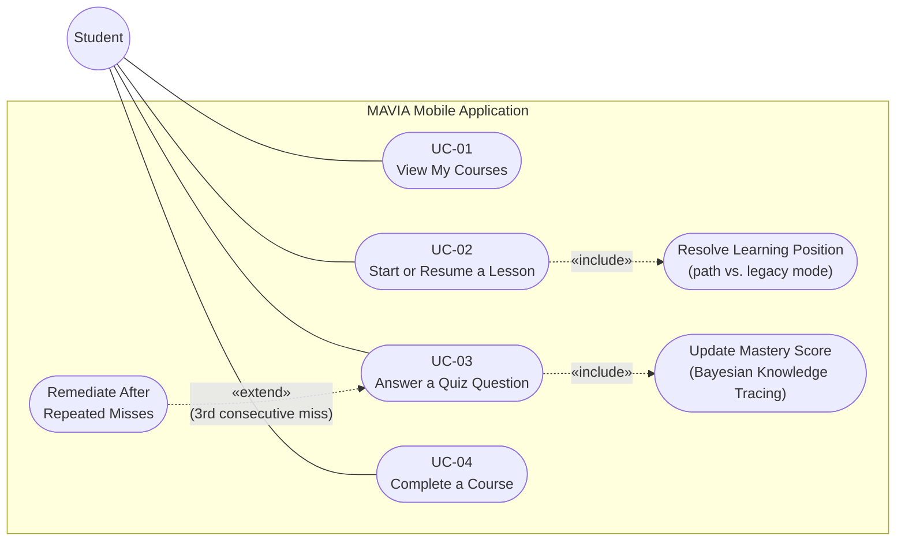
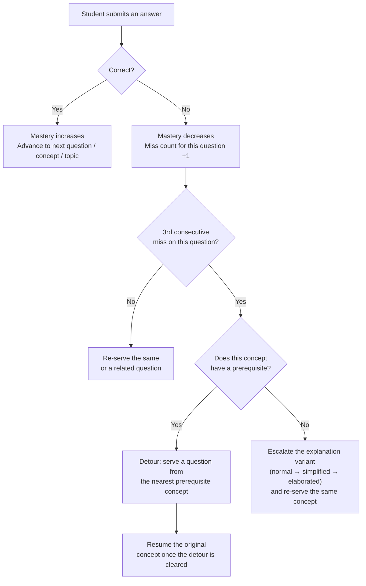

# MAVIA — UI Screen Documentation and Use Case Specification

**System:** MAVIA (mobile-app + web-app + backend), `k:\STUDIO\mavia`
**Prepared for:** Thesis system analysis and design chapter
**Scope:** Part I documents every screen in the MAVIA mobile application (student)
and the MAVIA web application (public, student, teacher, and admin). Part II
gives the formal use case specification for the Student actor's interaction
with the mobile application, which implements the system's adaptive learning
engine.

---

## Part I — UI Screen Documentation

### A. Mobile Application (Student)

The MAVIA mobile application is the exclusive interface through which a
student experiences the platform. It is built with Expo Router and is
designed to be operated primarily through a paired physical six-button
braille controller rather than the touchscreen, in keeping with the system's
purpose of teaching elementary science to young blind and visually impaired
learners.

#### 1. Log In

This screen allows a returning user to authenticate into the mobile
application using a username and password. On submission, the application
requests an authentication token from the server and, once the token is
received, determines where to send the user next based on the account's
assigned role: a student account proceeds into the application's home
screen, while a teacher or admin account is redirected to a screen
explaining that those roles are served by the web application instead. The
screen also provides links for a new user to create an account and for an
existing user to request a new email verification link.

#### 2. Create Account (Register)

This screen allows a new student to register for a MAVIA account. Because
the mobile application is the student-only client, the role submitted with
the registration request is fixed to Student and is never presented to the
user as a choice. The form collects the student's first name, last name,
username, email address, and password. Upon successful submission, the
screen replaces the form with a confirmation panel instructing the student
to open the verification link that was sent to the submitted email address
before attempting to log in.

#### 3. Resend Verification Email

This screen allows a user who did not receive, or can no longer find, their
original verification email to request that a new one be sent. The user
enters the email address used at registration; the system responds with a
generic confirmation message regardless of whether that address belongs to
an existing account, so that the screen cannot be used to determine whether
a given email address is registered.

#### 4. Account Not Supported

This screen is shown in place of the student home screen whenever a user who
has successfully logged in holds the Teacher or Admin role rather than the
Student role. It states plainly that the mobile application only serves the
student experience and directs the user to the MAVIA web application for
teacher or admin access. The only action available on this screen is to log
out.

#### 5. Home — Course List

This is the landing screen of the student experience once logged in, and the
first tab of the application's two-tab bottom navigation (Home and Profile).
It presents two views of the student's courses at once: a horizontally
scrolling "Continue learning" row showing the courses the student has
already started, and a searchable, alphabetically browsable "All courses"
list showing every course made available to the student. Selecting a search
field lets the student filter the course list by title as they type.
Selecting a course from either view opens that course's detail screen. The
screen refreshes its data every time it regains focus, so that progress made
elsewhere in the application is reflected immediately upon returning to it.

#### 6. Course Detail — Lesson List

This screen is reached by selecting a course from the Home screen. It
displays the course's title beneath a colored banner and lists every lesson
published under that course, each labeled with its title and an estimated
duration. A large play button on the banner opens the course's first lesson
directly; selecting an individual lesson row opens that specific lesson
instead. If the course has not yet had any lessons published to it, the
screen displays a message explaining that lessons will appear once the
student's teacher publishes them.

#### 7. Lesson Player

This is the screen in which the student actually consumes lesson content and
answers questions, and is the screen in which the system's adaptive learning
engine is exercised. It proceeds through three phases in order: an audio
phase, in which the lesson's narration is played back with standard audio
transport controls (play, pause, seek, skip to next or previous track) and
its accompanying text is shown on screen; a questions phase, in which the
student answers one question at a time and is shown immediate feedback
indicating whether the answer was correct; and a completion phase, in which
the student is shown a summary message and returned to the course's lesson
list. A progress bar and elapsed/remaining time are shown throughout the
audio phase.

This same screen serves two different underlying content structures without
the student needing to be aware of the distinction. For a course topic that
has not yet been organized into a teacher-approved learning path, the screen
plays through that lesson's full narration playlist and its plain list of
questions in order. For a course topic that has been organized into a
published learning path, the screen instead presents one prerequisite-linked
concept at a time — narration for that single concept, followed by exactly
two questions on it, one requiring recall and one requiring reasoning. In
this second mode the screen additionally displays small contextual notices
that are not present in the first: a badge naming the current explanation
variant whenever the student is being shown a simplified or more elaborated
version of a concept's explanation rather than the standard one, and a
banner reading "Quick review before you continue — you'll pick back up where
you left off" whenever the system has temporarily detoured the student
through an earlier prerequisite concept before returning them to the point
at which they were struggling.

#### 8. Profile

This screen displays the logged-in student's account information: their
display name and avatar initials, their email address, their account role,
their username, and whether their email address has been verified. Its only
interactive control logs the student out and returns them to the Log In
screen.

---

### B. Web Application

The MAVIA web application serves three audiences with role-specific
navigation and dashboards: unauthenticated visitors, authenticated teachers
and admins (who author and review course content), and authenticated
students (who are redirected to a single informational screen, since the
student learning experience itself is mobile-only).

#### Public

**Landing Page** — The public home page at the root URL. It presents the
platform's value proposition — a physical braille interface paired with
adaptive audio lessons — and directs an unauthenticated visitor to either
register as a teacher or read more on the About page; an authenticated
visitor instead sees a single button leading to their own role's dashboard.

**About / Contact** — A single shared template used for both the About and
Contact routes, differing only in the title and body text passed to it. It
displays static descriptive copy about the platform's purpose and how to
reach the MAVIA team, with no user interaction or data loading.

**Log In** — A split-panel screen shared by every role: a brand and value
proposition on one side, a username-and-password form on the other. A
visitor who is already authenticated is redirected away from this screen
before it renders. On successful login, the visitor is sent either back to
the page they were trying to reach before being asked to log in, or to their
role's default dashboard.

**Sign Up (Register)** — Registration on the web application is restricted
to the Teacher role; there is no role selector on the form, and students are
directed to register from the mobile application instead. The form collects
name, username, email, and password, and on submission either shows an
email-verification prompt or proceeds directly to the Log In screen,
depending on whether email verification is required by the server.

**Verify Email** — Confirms a newly registered account's email address.
When opened from a link containing a verification token, the screen requires
a deliberate button press before contacting the server, rather than
verifying automatically the instant the page loads; this is a deliberate
precaution against email clients that prefetch links, which would otherwise
silently consume a one-time verification token before the user had a chance
to click it themselves. Without a token, the screen instead presents a form
for requesting a new verification email.

#### Student (Web)

**Get the Mobile App** — The only screen a student account reaches on the
web application. It greets the student by name and explains that the actual
lesson experience — audio narration, the paired braille controller, and
progress tracking — lives on the MAVIA mobile application, instructing the
student to install it and sign in there with the same credentials.

#### Teacher

**Dashboard** — The teacher's landing page after login. It lists every
course the teacher has created, each linking to that course's content
hierarchy and to its read-only content review screen, alongside a shortcut
for creating a new course.

**Courses** — A complete listing of every course visible to the
teacher or admin account, each row showing its extracted topic count and
outline-confirmation status, with a shortcut to create a new course and a
delete action (with confirmation) on each existing one.

**New Course** — The first step of authoring a course: a short form
collecting only the course's name and an optional description. Successful
submission proceeds directly to that course's detail screen so the teacher
can continue by uploading its outline.

**Course Detail** — Where a teacher uploads a course's outline PDF and
reviews the topic hierarchy the system automatically extracted from it. The
system distinguishes an outline PDF from a lesson PDF automatically based on
its content, placing a lesson PDF directly under the topic it best matches.
While the hierarchy remains unconfirmed it can be freely edited — topics
renamed, added, reordered, or deleted; once the teacher explicitly confirms
the hierarchy, editing is disabled so that every piece of content generated
afterward stays mapped to topics the teacher has actually approved.
Selecting a confirmed topic opens the Topic Workspace screen.

**Topic Workspace** — The most complex screen in the web application: a
per-topic authoring surface combining direct editing of each uploaded PDF's
extracted content with a five-step content review pipeline that turns raw
lesson material into a single published, narrated, question-bearing topic.
A sidebar lists every PDF uploaded under the topic; selecting one opens a
Content tab for editing its extracted passages and an Audio tab for
reviewing its generated narration. The five-step review pipeline —
reachable from the same screen — walks the teacher through, in order:
resolving candidate duplicate content between PDFs, generating and reviewing
quiz questions per concept, reviewing the system's simplified and elaborated
rewrites of each concept's explanation, a final combined review of every
concept's content and questions before publishing, and reviewing the
prerequisite learning-path ordering the system derived across the topic's
concepts before publishing the topic in full.

**Learning Path** — A standalone screen presenting the same
prerequisite-ordering tool found in step five of the Topic Workspace's
review pipeline, for revisiting a topic's concept sequencing after it has
already been published. A concept sequence can be viewed either as an
ordered list or as a branching concept map; selecting any concept highlights
which concepts must be learned before it and which build upon it.

**Review Courses** — An entry point listing every course as a card, each
showing its topic count and outline status, for the teacher to select one to
inspect in detail.

**Course Review** — A read-only view of exactly what the mobile application
delivers to students for a given course, organized by module, alongside a
roster of enrolled students and each one's live progress. Expanding a module
reveals its narration tracks (with an indicator of whether audio has been
generated for each) and its questions with their correct answers. A separate
table lists every enrolled student's mastery level, number of questions
answered, correct-answer rate, modules completed, and time since last
activity, with controls to search for and enroll additional students or
remove an existing enrollment.

#### Admin

**Admin Overview** — The admin's landing page, offering two entry points:
the same course management tools available to teachers, and the adaptive
engine's configuration screen.

**Adaptive Weights** — Allows an admin to tune the numeric constants that
govern the adaptive engine's Bayesian Knowledge Tracing model: the
probability of a correct guess, the probability of an accidental slip on a
known answer, the rate at which mastery increases with each attempt, the
mastery level a new learner starts at, and the ceiling mastery can reach.
Each constant is presented as a labeled slider between zero and one with
plain-language guidance on what raising or lowering it does, and changes
take effect for every learner in the system immediately upon saving; there
is no per-course override.

---

## Part II — Use Case Specification: Mobile Application

### Actor

**Student** — A registered MAVIA user assigned the Student role, enrolled in
at least one course by a teacher. The Student is the sole actor of the
mobile application and interacts with the system exclusively through it,
typically via a paired physical six-button braille controller.

### Use Case Diagram

*Figure 1. The Student actor's four use cases in the mobile application.
Starting or resuming a lesson always includes resolving whether the current
topic is sequenced through a published learning path or the default lesson
order; answering a quiz question always includes updating the student's
mastery score, and extends into a remediation use case whenever the student
misses the same question three times in a row.*

### Summary of Use Cases

| ID | Use Case Name | Description |
|---|---|---|
| UC-01 | View My Courses | The student views the courses he or she is enrolled in, together with a summary of progress in each. |
| UC-02 | Start or Resume a Lesson | The system places the student at the correct topic and question, whether beginning a course or returning to one already in progress. |
| UC-03 | Answer a Quiz Question | The system grades the student's answer, updates the student's mastery level, and determines the next learning activity. |
| UC-04 | Complete a Course | The system recognizes that every topic in a course has been mastered and marks the course as completed for the student. |

---

### UC-01 — View My Courses

| Field | Description |
|---|---|
| **Use Case Name** | View My Courses |
| **Use Case ID** | UC-01 |
| **Primary Actor** | Student |
| **Description** | This use case describes how a registered student views the courses he or she is currently enrolled in, together with a summary of his or her progress in each one. The course list is presented on the Home screen, which serves as the landing screen of the MAVIA mobile application, and is the starting point from which the student proceeds to open a specific lesson. |
| **Trigger** | The student opens the MAVIA mobile application, or returns to the Home tab from elsewhere in the application. |

**Preconditions**
1. The student has a registered MAVIA account assigned the Student role.
2. The student is successfully logged in to the mobile application.

**Basic Flow of Events**

| Step | Actor Action | System Response |
|---|---|---|
| 1 | The student opens the MAVIA mobile application, or returns to the Home tab. | The system requests the list of courses the student is enrolled in, together with the subset of those courses the student has already begun. |
| 2 | — | The system displays the courses already in progress as a horizontally scrolling "Continue learning" row. |
| 3 | — | The system displays every enrolled course as a searchable list under "All courses," each entry showing the course title and its number of lessons. |
| 4 | The student may enter text into the search field to filter the course list by title. | The system narrows the displayed list to courses whose title matches the entered text. |
| 5 | The student selects a course from either view. | The system begins the process of opening that course's lesson list, described in Course Detail — Lesson List. |

**Alternate Flows**

- **A1.** If the student has not yet started any course, the "Continue learning" row is replaced with a message indicating that courses the student starts will appear there.
- **A2.** If no courses have been made available to the student at all, the "All courses" list is replaced with a message indicating that the student's teacher has not yet added any courses.

**Exception Flows**

- **E1.** If the mobile application is unable to reach the server, the affected section of the screen displays an empty or error state rather than a course list.

**Postconditions**
1. The system has displayed every course the student is enrolled in.
2. Courses already in progress are distinguished from courses not yet started.

---

### UC-02 — Start or Resume a Lesson

| Field | Description |
|---|---|
| **Use Case Name** | Start or Resume a Lesson |
| **Use Case ID** | UC-02 |
| **Primary Actor** | Student |
| **Description** | This use case describes how the system determines the correct lesson content and question to present to a student upon opening a lesson, whether the student is beginning that lesson for the very first time or returning to a course already in progress. The system distinguishes between a first-time visit, which requires the student's starting position within the course to be computed, and a returning visit, which requires the student's previously saved position to be restored exactly as it was left. |
| **Trigger** | The student selects a lesson to open from a course's Lesson List screen. |

**Preconditions**
1. The student is logged in to the MAVIA mobile application with the Student role.
2. The student is officially enrolled in the selected course, as recorded by the student's teacher through the MAVIA web application.

**Basic Flow of Events**

| Step | Actor Action | System Response |
|---|---|---|
| 1 | The student selects a lesson to open. | The system loads the packaged content of the selected lesson and, in parallel, verifies the student's enrollment in its course and establishes or resumes that student's learning session for the course. |
| 2 | — | If no learning-progress record exists yet for this student and course, the system determines the first topic in the course containing published content, following the order in which the course was structured by the teacher. |
| 3 | — | The system checks whether that topic has an approved, published learning path — a teacher-reviewed concept sequence describing which ideas must be understood before others. If a learning path exists, the system places the student at the first question of that path's first concept. If no learning path has been published for that topic, the system instead places the student at the first question found in the lesson's plain question list. |
| 4 | — | If a learning-progress record already exists for this student and course and the course has not yet been completed, the system restores the student's exact saved position — including the specific topic, question, and any remediation activity in progress — instead of starting the course over. |
| 5 | — | The system returns the student's current mastery level and current position to the mobile application, together with the packaged lesson content. |
| 6 | — | The mobile application begins the audio phase of the Lesson Player screen, playing the narration for the current content and preparing the current question to be presented once narration ends or is skipped. |

**Alternate Flows**

- **A1 — Resume.** If an active learning-progress record already exists for the student and course, Steps 2 and 3 are skipped entirely, and the system relies on Step 4 to resume the student's position exactly as it was left, including mid-way through any remedial activity.
- **A2 — No published content.** If the selected course does not yet contain any published lesson material for the topic being entered, the system informs the student that no lesson is currently available.

**Exception Flows**

- **E1.** If the student attempts to open a lesson belonging to a course in which he or she is not enrolled, the system denies the request and displays the message "You are not enrolled in this course."

**Postconditions**
1. A learning-progress record exists for the student and the selected course.
2. The system has identified the exact topic, lesson step, and question the student is to be presented with next.
3. The mobile application has received the packaged lesson content — narration text, narration audio, and the current question — required to display the lesson.

**Includes:** Resolve Learning Position — the sub-process by which the system determines whether the topic being entered is sequenced through a published learning path or through the default lesson order.

---

### UC-03 — Answer a Quiz Question

| Field | Description |
|---|---|
| **Use Case Name** | Answer a Quiz Question |
| **Use Case ID** | UC-03 |
| **Primary Actor** | Student |
| **Description** | This use case describes how the system evaluates a student's submitted answer to a quiz question and determines the student's next learning activity on the basis of that evaluation. It represents the core adaptive-learning mechanism of the MAVIA system: rather than presenting every student with the same fixed sequence of questions, the system continuously re-estimates how well the student has mastered the current topic using a Bayesian Knowledge Tracing model, and adjusts the difficulty, sequence, and level of explanation of subsequent questions accordingly. |
| **Trigger** | The student selects an answer option for the question currently displayed on the Lesson Player screen and submits it. |

**Preconditions**
1. The student has an active learning session for the course, established through Start or Resume a Lesson (UC-02).
2. The question being answered is the same question the system currently has on record as the student's active question.
3. The lesson containing the question has not been unpublished by the teacher since the session began.

**Basic Flow of Events**

| Step | Actor Action | System Response |
|---|---|---|
| 1 | The student selects an answer choice for the currently displayed question and submits it. | The system verifies that the submitted question matches the question currently assigned to the student, and that the student remains enrolled in the course. |
| 2 | — | The system compares the student's selected answer with the question's correct answer to determine whether the response is correct. |
| 3 | — | The system recalculates the student's mastery level for the topic using a Bayesian Knowledge Tracing model. The model raises the mastery estimate when the answer is correct and lowers it when the answer is incorrect, while accounting for the probability that a correct answer was a lucky guess and the probability that an incorrect answer was a careless slip despite the student actually knowing the material. |
| 4 | — | If the answer is correct, the system marks the current question as cleared and advances the student to the next unanswered question within the current concept. If both questions in the current concept have been answered correctly, the system advances to the next concept in the topic's learning path — or, if the concept just cleared was a temporary detour through a prerequisite, the system instead returns the student to the point at which they had been struggling. If the entire topic has been cleared, the system advances the student to the next topic in the course. |
| 5 | — | If the answer is incorrect, the system increases the count of consecutive incorrect attempts recorded for the current question and keeps the student on the same concept, presenting the same or a related question again. |
| 6 | — | The system saves the student's updated mastery level, current position, and response record, and returns the result of the evaluation to the mobile application. |
| 7 | — | The mobile application displays feedback indicating whether the answer was correct and, once the student proceeds, advances to whichever question, concept, or topic the system determined to present next. |

**Alternate Flows**

- **A1 — Correct answer.** The next unanswered question in the current concept is served if one remains; otherwise the system advances the student to the next concept or topic as described in Step 4 above.
- **A2 — Incorrect answer, first or second attempt.** The student remains on the same concept and is presented with the same or a related question again, with no change to the explanation variant shown.
- **A3 — Incorrect answer, third consecutive attempt, prerequisite available.** The system temporarily redirects the student to review and answer a question drawn from that concept's nearest prerequisite, as a refresher, and automatically returns the student to the point of difficulty once the prerequisite review has been answered correctly.
- **A4 — Incorrect answer, third consecutive attempt, no prerequisite available.** The system instead re-presents the same concept using a simplified or more elaborated version of its narration in place of the standard explanation, escalating the level of support given to the student with each additional failed attempt on that concept.
- **A5 — Course completed.** If the student answers the last remaining question in the course correctly and no further topic remains, the system marks the course as completed for that student, triggering Complete a Course (UC-04).

**Exception Flows**

- **E1.** If the answer submitted by the mobile application refers to a question that is no longer the student's currently assigned question — for example, because of a network delay or a duplicate submission — the system rejects the submission with the message "Answer the currently assigned question," and the mobile application re-synchronizes with the server before allowing the student to try again.
- **E2.** If the teacher unpublishes or revises the lesson while the student is in the middle of answering it, the system rejects the submission with the message "This lesson is no longer published."
- **E3.** If the student's enrollment in the course is removed while a learning session is active, the system denies any further submission of answers for that course.

**Postconditions**
1. The system has recorded the student's response, including whether it was correct.
2. The student's mastery level for the current topic has been recalculated.
3. The system has determined and recorded the next question, concept, or topic to be presented to the student.

**Includes / Extends:** Includes Update Mastery Score, the sub-process that recalculates the student's mastery level after every answered question. Extends into Remediate After Repeated Misses whenever the student answers the same question incorrectly three times in a row.

#### Remediation decision flow (UC-03, Steps 4–5)

*Figure 2. Decision flow followed by the adaptive engine each time a student
submits an answer, showing how the system escalates its response after
repeated incorrect attempts on the same question.*

---

### UC-04 — Complete a Course

| Field | Description |
|---|---|
| **Use Case Name** | Complete a Course |
| **Use Case ID** | UC-04 |
| **Primary Actor** | Student (recipient of a system-triggered outcome) |
| **Description** | This use case describes how the system recognizes that a student has correctly answered every required question in every topic of a course and formally marks that course as completed for the student. Unlike the other use cases in this document, it is not directly initiated by a deliberate action of the student; rather, it is triggered automatically by the outcome of Answer a Quiz Question (UC-03). |
| **Trigger** | The student correctly answers the final remaining question of the final topic in the course. |

**Preconditions**
1. The student has an active learning-progress record for the course.
2. No topic containing an unanswered required question remains in the course.

**Basic Flow of Events**

| Step | Actor Action | System Response |
|---|---|---|
| 1 | — | Immediately after evaluating the student's final correct answer, the system searches for a further topic containing unanswered content. Finding none, it marks the student's learning-progress record for the course as completed. |
| 2 | — | The system returns a course-completion indicator to the mobile application in place of a new question. |
| 3 | — | The mobile application displays a completion message to the student in place of the question screen and offers to return to the course's lesson list. |

**Alternate Flows:** None. This use case follows a single, deterministic flow.

**Exception Flows:** None. By precondition, this use case only begins once every required question in the course has already been answered correctly.

**Postconditions**
1. The student's learning-progress record for the course is marked as completed.
2. The student is no longer presented with further questions for that course.
3. The completed course is reflected with a completed status the next time the student views View My Courses (UC-01).

---

## Appendix — Implementation Reference

*The following is a technical reference and is not part of the formal use
case narrative above.*

- **Backend module:** `backend/adaptive` (Django app), mounted at
  `/api/adaptive/`. Endpoints exercised by the use cases above:
  `POST start/`, `POST submit-response/`, `GET learning-states/<id>/`,
  `GET my-courses/`, `GET my-courses/<id>/lessons/`, `GET lessons/<id>/`.
- **Mobile client:** `mobile-app/src/api/client.ts` calls the endpoints
  above; the lesson player at
  `mobile-app/app/(student)/home/[courseId]/[lessonId].tsx` implements the
  phase machine and the path-mode adapters (`stepTrack`, `stepQuestions`)
  described in the Lesson Player screen entry.
- **Path-mode design reference:** `backend/adaptive/PATH_MODE.md`.
- **Bayesian Knowledge Tracing constants:** configurable at runtime via the
  `adaptive_config` app (`P(guess)`, `P(slip)`, `P(learn)`, starting
  mastery, mastery ceiling); see the Adaptive Weights screen.
- **Remediation threshold:** a concept's question is escalated to
  remediation after 3 consecutive incorrect attempts
  (`MAX_STEP_QUESTION_ATTEMPTS` in `backend/adaptive/services.py`).

---

*Compiled from `k:\STUDIO\mavia` (`backend/adaptive`, `mobile-app/app`,
`mobile-app/src`, `web-app/src`) on 2026-09-16. Re-verify against the live
codebase before final submission, as this is an actively developed project.*
